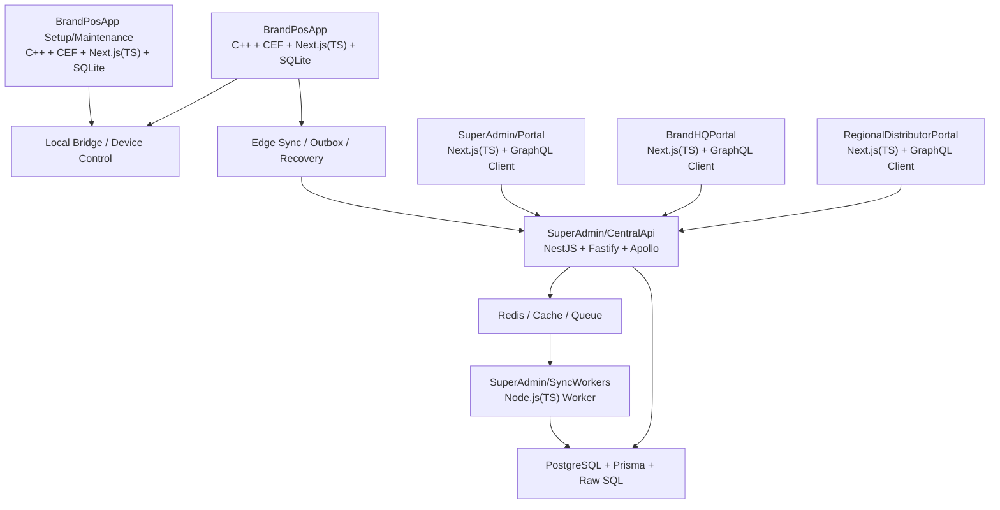

# Platform 최종 아키텍처 기준서
# Tài liệu chuẩn kiến trúc cuối cùng của Platform

> 기준 문서:
> - `HJ-POS-TEST`는 기능 참고용 레거시다.
> - 이 문서는 **신규 Platform 전체의 최종 스택 정의서**다.
> - 이후의 모든 프로젝트 설계서는 이 문서를 우선 기준으로 삼는다.
>
> Tài liệu căn cứ:
> - `HJ-POS-TEST` chỉ là legacy để tham khảo chức năng.
> - Đây là **tài liệu định nghĩa stack cuối cùng cho toàn bộ Platform mới**.
> - Tất cả tài liệu thiết kế sau này phải ưu tiên tài liệu này.

---

## 1. 목적
## 1. Mục đích

### 한국어

이 문서는 `EdgePos / RegionalDistributorPortal / BrandHQPortal / SuperAdmin / CentralApi / SyncWorkers`를 포함한 전체 플랫폼의 기술 스택을 하나의 기준으로 고정한다.

이 문서가 해결하려는 문제는 다음과 같다.

- 프로젝트마다 다른 기술 선택
- UI / API / Worker / DB 경계의 혼선
- GraphQL / REST / Queue / Sync 계약의 중복
- Edge와 Central의 저장소 전략 불일치

### Tiếng Việt

Tài liệu này cố định một bộ stack chuẩn cho toàn bộ platform, bao gồm `EdgePos / RegionalDistributorPortal / BrandHQPortal / SuperAdmin / CentralApi / SyncWorkers`.

Những vấn đề mà tài liệu này giải quyết:

- Mỗi project dùng một lựa chọn kỹ thuật khác nhau
- Ranh giới UI / API / Worker / DB bị mờ
- Contract GraphQL / REST / Queue / Sync bị trùng lặp
- Chiến lược lưu trữ giữa Edge và Central không nhất quán

---

## 2. 플랫폼 전체 원칙
## 2. Nguyên tắc toàn platform

### 한국어

- **TypeScript는 웹/서버의 기본 언어**다.
- **C++는 Native Host와 공용 로우레벨 계층에만 사용**한다.
- **GraphQL은 중앙 계약의 기본값**이다.
- **REST는 `SuperAdmin/CentralApi`에서만 Fastify로 사용한다.**
- **Edge는 Offline-First**다.
- **중앙은 Multi-Tenant**다.
- **Edge 로컬 저장소는 SQLite**를 기본으로 한다.
- **중앙 운영 저장소는 PostgreSQL**을 기본으로 한다.
- **공통 계약은 `SharedContracts`가 단일 원본**이다.

### Tiếng Việt

- **TypeScript là ngôn ngữ mặc định cho web/server**.
- **C++ chỉ dùng cho Native Host và tầng low-level dùng chung**.
- **GraphQL là mặc định cho contract trung tâm**.
- **REST chỉ dùng trong `SuperAdmin/CentralApi` và được triển khai bằng Fastify.**
- **Edge là Offline-First**.
- **Central là Multi-Tenant**.
- **SQLite là kho lưu trữ local mặc định của Edge**.
- **PostgreSQL là kho vận hành trung tâm mặc định**.
- **`SharedContracts` là nguồn gốc duy nhất của contract chung**.

### 2.1 표준 사업 계층 / Tầng nghiệp vụ chuẩn

#### 한국어

- `SuperAdmin`
  - 플랫폼 공급사 운영 주체
- `RegionalDistributor`
  - 국가/지역 독점 유통권을 가진 대리점/채널 파트너
- `BrandHQ`
  - 브랜드 본사 운영 주체
  - 식권 플랫폼 맥락에서는 **제휴식당(프랜차이즈 본사 또는 단일 매장 식당)** 도 이 계층에 해당한다.
- `Corporate`
  - **식권 플랫폼 전용 신규 계층.** B2B 식권 고객사(기업/회사) 운영 주체.
  - `BrandHQ` 의 형제 계층이며, `Branch` 를 소유하지 않고 임직원·예산·정책·세금계산서만 소유한다.
- `Branch`
  - 브랜드 산하의 개별 매장/지점
- `EdgePos`
  - 지점에 설치된 POS 실행 단말
- `Device`
  - EdgePos에 연결된 주변기기

#### Tiếng Việt

- `SuperAdmin`
  - chủ thể vận hành của nhà cung cấp platform
- `RegionalDistributor`
  - đại lý/đối tác kênh có quyền phân phối độc quyền theo quốc gia/khu vực
- `BrandHQ`
  - chủ thể vận hành cấp trụ sở thương hiệu
  - Trong ngữ cảnh nền tảng phiếu ăn, **nhà hàng đối tác (chuỗi hoặc đơn lẻ)** cũng thuộc tầng này.
- `Corporate`
  - **Tầng mới dành riêng cho nền tảng phiếu ăn.** Chủ thể vận hành doanh nghiệp khách hàng B2B.
  - Là tầng anh em với `BrandHQ`, không sở hữu `Branch`, chỉ sở hữu nhân viên / ngân sách / chính sách / hoá đơn.
- `Branch`
  - cửa hàng/chi nhánh trực thuộc thương hiệu
- `EdgePos`
  - EdgePos được cài tại chi nhánh
- `Device`
  - thiết bị ngoại vi kết nối với EdgePos

### 2.2 DB 식별자 표준 / Định danh DB chuẩn

#### 한국어

- `SuperAdminId`
  - 플랫폼 운영자 계정 식별자
- `RegionalDistributorId`
  - 지역/국가 유통 파트너 식별자
- `BrandHQId`
  - 브랜드 본사 식별자
- `BranchId`
  - 지점/매장 식별자
- `EdgePosId`
  - Edge POS 단말 식별자
- `DeviceId`
  - 주변기기 식별자
- `OperatorId`
  - 운영자/직원 계정 식별자
- `PolicyVersion`
  - 정책 버전 식별자
- `CatalogVersion`
  - 메뉴/카탈로그 버전 식별자
- `SyncCursor`
  - 동기화 위치 식별자

#### Tiếng Việt

- `SuperAdminId`
  - định danh tài khoản vận hành platform
- `RegionalDistributorId`
  - định danh đối tác phân phối theo khu vực/quốc gia
- `BrandHQId`
  - định danh trụ sở thương hiệu
- `BranchId`
  - định danh chi nhánh/cửa hàng
- `EdgePosId`
  - định danh EdgePos
- `DeviceId`
  - định danh thiết bị ngoại vi
- `OperatorId`
  - định danh tài khoản người vận hành/nhân viên
- `PolicyVersion`
  - định danh version policy
- `CatalogVersion`
  - định danh version catalog/menu
- `SyncCursor`
  - định danh vị trí đồng bộ

---

## 3. 전체 스택 한눈에 보기
## 3. Toàn cảnh stack



### 한국어

이 구조의 핵심은 다음 한 줄이다.

`Edge는 C++ + CEF + Next.js + SQLite`, `중앙은 Next.js + NestJS + Fastify + GraphQL + PostgreSQL`, `공유는 TypeScript 계약`이다.

### Tiếng Việt

Điểm cốt lõi của cấu trúc này là:

`Edge = C++ + CEF + Next.js + SQLite`, `Central = Next.js + NestJS + Fastify + GraphQL + PostgreSQL`, `Shared = contract TypeScript`.

### 2.3 프로젝트별 확정 SPEC 요약 / Tóm tắt đặc tả cố định theo project

| Project | 확정 SPEC | DB / Storage | 계약 / 통신 | 비고 |
|---|---|---|---|---|
| `BrandPosApp` | `C++ + CEF + Next.js(TypeScript)` | `SQLite` local DB | `cefQuery` + realtime event | POS mode + Setup/Maintenance mode 포함 |
| `RegionalDistributorPortal` | `Next.js(TypeScript) + App Router` | Direct DB access 없음 | `Apollo Client` + GraphQL-first | 대리점/통합유통 전용 Web 프로젝트 |
| `BrandHQPortal` | `Next.js(TypeScript) + App Router` | Direct DB access 없음 | `Apollo Client` + GraphQL-first | 브랜드 본사 운영 포털 |
| `SuperAdmin/Portal` | `Next.js(TypeScript) + App Router` | Direct DB access 없음 | `Apollo Client` + GraphQL-first | 공급사 운영 포털 |
| `SuperAdmin/CentralApi` | `NestJS + Fastify + Apollo Server` | `Prisma + PostgreSQL + raw SQL/TypedSQL` | GraphQL-first, REST only in CentralApi via Fastify | 멀티테넌시, RBAC, audit, sync hub |
| `SuperAdmin/SyncWorkers` | `Node.js(TypeScript) + BullMQ` | `Redis` + Central DB | Queue-driven | outbox, retry, reconciliation |
| `SharedKernel` | `C++ shared kernel` | - | native helper / protocol | low-level 공용 계층 |
| `SharedContracts` | `TypeScript contract package` | - | DTO / enum / schema | 공통 계약 단일 원본 |
| `SharedAssets` | versioned runtime assets package | - | static assets only | 공용 자산 원본 (i18n 제외, build-time copy 대상만 유지) |

### 2.4 다국어/SharedAssets 배포 원칙 / Nguyên tắc đa ngôn ngữ và triển khai SharedAssets

#### 한국어

- `SharedAssets`는 공용 런타임 서버가 아니라 버전 관리된 원본 패키지다.
- 번역 원본은 각 프로젝트 내부 i18n 이다. `SharedAssets`에는 i18n 을 두지 않는다.
- 각 플랫폼은 자기 빌드 파이프라인에서 필요한 locale 자산을 자체 패키징해서 사용한다.
- 프로덕션 서버가 서로 달라도, 같은 `SharedAssets` 버전만 배포물에 포함되면 된다. 번역은 각 프로젝트 번들에 포함한다.
- 사용자/브랜드/지점별 언어 선호도는 DB 설정으로 관리하고, 실제 표시 문자열은 locale key로 해석한다.
- 지원 언어의 기본 세트는 `ko`, `vi`, `en`이다.

#### Tiếng Việt

- `SharedAssets` không phải là một shared runtime server, mà là một gói nguồn được version hóa.
- Nguồn dịch nằm trong i18n nội bộ của từng project, `SharedAssets` không chứa i18n.
- Mỗi platform sẽ tự đóng gói locale assets cần thiết trong pipeline build của chính nó.
- Dù production server khác nhau, chỉ cần cùng một version `SharedAssets` nằm trong artifact là đủ. Phần dịch nằm trong artifact của từng project.
- Preference ngôn ngữ theo user/brand/branch được quản lý trong DB; chuỗi hiển thị thực tế được resolve theo locale key.
- Bộ ngôn ngữ mặc định là `ko`, `vi`, `en`.

---

## 4. 프로젝트별 전체 스택 정의
## 4. Định nghĩa stack theo từng project

### 4.1 BrandPosApp
### 4.1 BrandPosApp

#### 한국어

- 역할: 매장 단말에서 실행되는 Edge POS
- 런타임: C++ Native Host
- UI 셸: CEF
- 화면: Next.js + TypeScript
- 상태: Redux Toolkit + RTK Query
- 로컬 저장소: SQLite
- 장치 제어: C++ native bridge
- 통신: `cefQuery` 기반 request/response + realtime event
- 저장 책임: 오프라인 주문, 결제, 테이블 상태, sync backlog, recovery state
- 금지: MFC UI 유지, 중앙 DB 직접 접근, 화면에서 DB 직결

#### Tiếng Việt

- Vai trò: EdgePos chạy tại cửa hàng
- Runtime: C++ Native Host
- UI shell: CEF
- Màn hình: Next.js + TypeScript
- State: Redux Toolkit + RTK Query
- Lưu trữ local: SQLite
- Điều khiển thiết bị: C++ native bridge
- Giao tiếp: request/response qua `cefQuery` + realtime event
- Trách nhiệm lưu: order offline, thanh toán, trạng thái bàn, sync backlog, recovery state
- Không được: giữ MFC UI, truy cập trực tiếp DB trung tâm, nối DB trực tiếp từ màn hình

### 4.2 BrandPosApp Setup/Maintenance mode
### 4.2 BrandPosApp Setup/Maintenance mode

#### 한국어

- 역할: 매장 단말 초기 설정과 유지보수 모드
- 런타임: C++ Native Host
- UI 셸: CEF
- 화면: Next.js + TypeScript
- 로컬 저장소: SQLite 또는 설정 파일 기반 저장소
- 장치 연동: 네트워크 프린터, 카드리더, 스캐너, 로컬 설정
- 통신: `cefQuery` + native command
- 금지: 운영 주문/결제 로직을 여기서 직접 처리

#### Tiếng Việt

- Vai trò: chế độ cài đặt ban đầu và bảo trì của EdgePos
- Runtime: C++ Native Host
- UI shell: CEF
- Màn hình: Next.js + TypeScript
- Lưu trữ local: SQLite hoặc file cấu hình
- Tích hợp thiết bị: printer mạng, card reader, scanner, cấu hình local
- Giao tiếp: `cefQuery` + native command
- Không được: xử lý trực tiếp order/thanh toán nghiệp vụ tại đây

### 4.3 RegionalDistributorPortal

#### 한국어

- 역할: 대리점/통합유통 전용 Web 프로젝트
- 프론트엔드: Next.js + TypeScript
- 라우팅: Next.js App Router
- 서버 상태: Apollo Client
- 계약: GraphQL-first
- 중앙 연결: `SuperAdmin/CentralApi`
- UI 상태: 필요 시 Redux Toolkit
- DB 직접 접근: 없음
- 주요 기능: 브랜드 온보딩, 계약/라이선스, 배포 범위 계산, 지역 정책, 현지 지원, 정산 추적

#### Tiếng Việt

- Vai trò: web project chuyên dụng cho tầng đại lý/phân phối
- Frontend: Next.js + TypeScript
- Routing: Next.js App Router
- Server state: Apollo Client
- Contract: GraphQL-first
- Kết nối trung tâm: `SuperAdmin/CentralApi`
- UI state: dùng Redux Toolkit khi cần
- Không truy cập DB trực tiếp
- Chức năng chính: onboarding brand, hợp đồng/license, tính phạm vi rollout, policy theo vùng, hỗ trợ địa phương, theo dõi settlement

### 4.4 BrandHQPortal

#### 한국어

- 역할: 브랜드 본사 운영 포털
- 프론트엔드: Next.js + TypeScript
- 라우팅: Next.js App Router
- 서버 상태: Apollo Client
- 계약: GraphQL-first
- 중앙 연결: `SuperAdmin/CentralApi`
- UI 상태: 필요 시 Redux Toolkit
- DB 직접 접근: 없음
- 주요 기능: 메뉴, 지점, 가격, 프로모션, 직원, 리포트, 브랜드 정책

#### Tiếng Việt

- Vai trò: cổng vận hành cấp brand HQ
- Frontend: Next.js + TypeScript
- Routing: Next.js App Router
- Server state: Apollo Client
- Contract: GraphQL-first
- Kết nối trung tâm: `SuperAdmin/CentralApi`
- UI state: dùng Redux Toolkit khi cần
- Không truy cập DB trực tiếp
- Chức năng chính: menu, chi nhánh, giá, khuyến mãi, nhân sự, báo cáo, policy thương hiệu

### 4.5 SuperAdmin/Portal
### 4.5 SuperAdmin/Portal

#### 한국어

- 역할: 공급사 운영 포털
- 프론트엔드: Next.js + TypeScript
- 라우팅: Next.js App Router
- 서버 상태: Apollo Client
- 계약: GraphQL-first
- 중앙 연결: `SuperAdmin/CentralApi`
- 주요 기능: 브랜드 온보딩, 라이선스, 버전 배포, 장애 모니터링, 원격 지원, 글로벌 감사 로그
- 금지: 브랜드 실무 운영 화면을 여기서 중복 구현하지 않음

#### Tiếng Việt

- Vai trò: cổng vận hành của nhà cung cấp
- Frontend: Next.js + TypeScript
- Routing: Next.js App Router
- Server state: Apollo Client
- Contract: GraphQL-first
- Kết nối trung tâm: `SuperAdmin/CentralApi`
- Chức năng chính: onboarding brand, license, rollout version, monitoring sự cố, hỗ trợ từ xa, audit log toàn cục
- Không được: triển khai trùng màn hình vận hành nghiệp vụ của brand

### 4.5 SuperAdmin/CentralApi
### 4.5 SuperAdmin/CentralApi

#### 한국어

- 역할: 중앙 인증/권한/API/배포 계약의 단일 백엔드
- 런타임: NestJS + Fastify
- API 표면: Apollo Server 5 GraphQL-first
- 예외 API: REST는 `SuperAdmin/CentralApi`에서만 Fastify로 구현하며, webhook, file upload, health check, auth callback 같은 예외에만 사용
- 데이터 접근: Prisma + raw SQL + TypedSQL
- 중앙 DB: PostgreSQL
- 캐시/큐: Redis
- 주요 책임: 멀티테넌시, RBAC, 정책, 카탈로그, 버전, 동기화 계약, audit
- 현재 구현 기준:
  - tenant boundary는 resolver 설명이 아니라 service layer filter로 강제한다
  - request-scoped DataLoader는 tenant-aware batch loading만 담당한다
  - GraphQL depth limit와 query complexity guard를 활성화한다
  - production error masking을 적용한다
  - Fastify에는 `helmet`, `compress`, timeout, graceful shutdown을 기본 적용한다
  - Prisma에는 slow query logging과 pool parameter validation을 기본 적용한다
  - Redis는 login rate limit, sync distributed lock/stream, reference data cache에 실제 사용한다
- 금지: Edge POS 로컬 DB를 직접 대체하지 않음

#### Tiếng Việt

- Vai trò: backend đơn nhất cho authentication/authorization/API/deploy contract trung tâm
- Runtime: NestJS + Fastify
- Mặt API: Apollo Server 5 GraphQL-first
- API ngoại lệ: REST chỉ dùng trong `SuperAdmin/CentralApi` và được triển khai bằng Fastify; chỉ dùng cho webhook, upload file, health check, auth callback
- Truy cập dữ liệu: Prisma + raw SQL + TypedSQL
- DB trung tâm: PostgreSQL
- Cache/queue: Redis
- Trách nhiệm chính: multi-tenancy, RBAC, policy, catalog, version, contract sync, audit
- Theo chuẩn triển khai hiện tại:
  - tenant boundary được cưỡng chế ở service layer filter, không chỉ mô tả ở resolver
  - request-scoped DataLoader chỉ phụ trách tenant-aware batch loading
  - bật GraphQL depth limit và query complexity guard
  - áp dụng production error masking
  - Fastify mặc định có `helmet`, `compress`, timeout, graceful shutdown
  - Prisma mặc định có slow query logging và pool parameter validation
  - Redis được dùng thực tế cho login rate limit, sync distributed lock/stream, reference data cache
- Không được: thay thế trực tiếp DB local của Edge POS

#### 구현 완료된 구조 보강 / Hạng mục gia cố đã triển khai

- `@platform/api-sdk`: `SharedContracts/ApiSdk`에 APQ 대응 fetch client와 typed operation을 갖는 내부 SDK 패키지를 추가했고, 현재 `BrandHQ / RegionalDistributor / Branch / EdgePos / Policy / Deploy / SyncEvent` 읽기 연산을 포함한다.
- `cursor pagination`: `AuditLog`, `SyncEvent` 대량 조회는 각각 `auditLogConnection`, `syncEventConnection` 기준의 keyset pagination으로 보강했다.
- `APQ`: CentralApi는 Apollo Persisted Queries를 활성화했고, Redis가 있으면 Redis-backed cache, 없으면 bounded in-memory cache로 동작한다.
- `persisted query allow-list`: `@platform/api-sdk` build가 persisted-operation manifest를 자동 생성하고, CentralApi는 generated allow-list JSON을 동기화해 allow-listed hash만 허용하도록 강제한다.
- `Prisma multi-file schema`: `prisma.config.ts` + `prisma/schema/*.prisma` 구조로 전환했고, 단일 `schema.prisma`는 제거했다.
- `SWC builder`: `nest-cli.json`을 SWC + typeCheck + `.swcrc` 기준으로 전환해 빌드 속도를 개선했다.

- `@platform/api-sdk`: đã thêm gói SDK nội bộ tại `SharedContracts/ApiSdk` với fetch client hỗ trợ APQ và typed operation; hiện bao phủ các thao tác đọc cho `BrandHQ / RegionalDistributor / Branch / EdgePos / Policy / Deploy / SyncEvent`.
- `cursor pagination`: truy vấn lớn của `AuditLog` và `SyncEvent` đã được gia cố bằng keyset pagination qua `auditLogConnection` và `syncEventConnection`.
- `APQ`: CentralApi đã bật Apollo Persisted Queries; nếu có Redis thì dùng Redis-backed cache, nếu không thì dùng bounded in-memory cache.
- `persisted query allow-list`: build của `@platform/api-sdk` tự tạo persisted-operation manifest, còn CentralApi đồng bộ JSON allow-list generated để chỉ cho phép các hash đã được phê duyệt.
- `Prisma multi-file schema`: đã chuyển sang cấu trúc `prisma.config.ts` + `prisma/schema/*.prisma` và loại bỏ `schema.prisma` đơn khối.
- `SWC builder`: đã chuyển `nest-cli.json` sang SWC + typeCheck + `.swcrc` để cải thiện tốc độ build.

#### 다음 백로그 / Backlog tiếp theo

- `@platform/api-sdk` mutation 범위를 `Branch / EdgePos / DeployRelease` 및 핵심 관리 명령까지 확대
- Portal 3개가 hand-written Apollo 문서 대신 `@platform/api-sdk` operation wrapper를 직접 소비하도록 점진 전환
- production 배포 파이프라인에서 `GRAPHQL_PERSISTED_QUERY_ALLOW_LIST_ENABLED=true` 기준의 allow-list 강제 운영과 drift 검증 추가

- mở rộng phạm vi mutation của `@platform/api-sdk` sang `Branch / EdgePos / DeployRelease` và các lệnh quản trị chính
- chuyển dần 3 portal sang dùng trực tiếp operation wrapper của `@platform/api-sdk` thay cho tài liệu Apollo viết tay
- bổ sung vận hành production với `GRAPHQL_PERSISTED_QUERY_ALLOW_LIST_ENABLED=true` và kiểm tra drift của allow-list trong pipeline triển khai

### 4.6 SuperAdmin/SyncWorkers
### 4.6 SuperAdmin/SyncWorkers

#### 한국어

- 역할: sync, retry, reconciliation, distribution을 수행하는 워커
- 런타임: Node.js + TypeScript
- 큐: BullMQ + Redis
- 데이터 접근: Prisma + raw SQL/TypedSQL
- 책임: outbox 소비, 배포 작업, 재전송, 백오프, 상태 집계, 알림 전송, 동기화 실패 복구
- 금지: HTTP 서버를 주력 책임으로 삼지 않음

#### Tiếng Việt

- Vai trò: worker xử lý sync, retry, reconciliation và distribution
- Runtime: Node.js + TypeScript
- Queue: BullMQ + Redis
- Truy cập dữ liệu: Prisma + raw SQL/TypedSQL
- Trách nhiệm: tiêu thụ outbox, job phân phối, retransmit, backoff, tổng hợp trạng thái, gửi thông báo, phục hồi lỗi sync
- Không được: coi HTTP server là trách nhiệm chính

### 4.7 SharedKernel
### 4.7 SharedKernel

#### 한국어

- 역할: C++ 공용 기반 라이브러리
- 범위: native utility, bridge protocol, serialization, device helper, low-level wrapper
- 사용처: BrandPosApp POS mode, BrandPosApp Setup/Maintenance mode
- 금지: 업무 규칙과 웹 서버 로직을 넣지 않음

#### Tiếng Việt

- Vai trò: thư viện nền dùng chung cho C++
- Phạm vi: utility native, bridge protocol, serialization, device helper, low-level wrapper
- Nơi sử dụng: BrandPosApp POS mode, BrandPosApp Setup/Maintenance mode
- Không được: đưa nghiệp vụ hay logic web server vào đây

### 4.8 SharedContracts
### 4.8 SharedContracts

#### 한국어

- 역할: 앱들 사이에서 주고받는 계약의 단일 원본
- 형태: TypeScript package
- 포함: DTO, GraphQL schema type, enum, event envelope, validation schema
- 사용처: RegionalDistributorPortal, BrandHQPortal, SuperAdmin/Portal, CentralApi, SyncWorkers, EdgePos 계약 생성
- 금지: 화면 컴포넌트, DB 구현, 네이티브 로직

#### Tiếng Việt

- Vai trò: nguồn gốc duy nhất của contract trao đổi giữa các ứng dụng
- Hình thức: TypeScript package
- Bao gồm: DTO, GraphQL schema type, enum, event envelope, validation schema
- Nơi dùng: RegionalDistributorPortal, BrandHQPortal, SuperAdmin/Portal, CentralApi, SyncWorkers, contract của EdgePos
- Không được: chứa component UI, DB implementation, logic native

### 4.9 SharedAssets
### 4.9 SharedAssets

#### 한국어

- 역할: 버전 관리된 런타임 자산 원본
- 포함: fonts, icons, static assets
- 사용처: 각 플랫폼의 build artifact로 복사되어 사용됨
- 금지: 공용 런타임 서버처럼 직접 마운트하여 여러 플랫폼이 같은 파일 시스템을 공유하는 방식, 업무 로직, API 코드, DB 코드

#### Tiếng Việt

- Vai trò: nguồn tài sản runtime được version hóa
- Bao gồm: fonts, icons, static assets
- Nơi dùng: được copy vào build artifact của từng platform
- Không được: mount trực tiếp như shared runtime server để nhiều platform cùng dùng chung filesystem, chứa logic nghiệp vụ, API code, DB code

### 4.10 포털 공통 운영 원칙
### 4.10 Nguyên tắc vận hành chung cho portal

#### 한국어

- 적용 대상: `SuperAdmin/Portal`, `RegionalDistributorPortal`, `BrandHQPortal`
- 서버 상태는 `Apollo Client`가 담당한다.
- `Redux Toolkit`은 필요할 때만 UI 상태에 한정해서 사용한다.
- `Redis`와 `DataLoader`는 포털의 직접 책임이 아니라 백엔드 책임이다.
  - 포털은 Redis를 직접 사용하지 않는다.
  - 포털은 DataLoader를 직접 구현하지 않는다.
- 대량 목록은 pagination, lazy loading, fragment 분리, route-level code splitting으로 처리한다.
- `SharedContracts`를 DTO/enum/event의 단일 원본으로 사용한다.
- 각 프로젝트 내부 i18n을 번역 원본으로 사용한다.
- 유지보수 원칙:
  - 화면별 서버 상태를 Redux에 중복 저장하지 않는다.
  - feature domain 단위로 컴포넌트/쿼리/뮤테이션을 묶는다.
  - cache policy와 pagination policy를 문서와 코드에서 같이 관리한다.

#### Tiếng Việt

- Phạm vi áp dụng: `SuperAdmin/Portal`, `RegionalDistributorPortal`, `BrandHQPortal`
- Trạng thái server do `Apollo Client` phụ trách.
- `Redux Toolkit` chỉ dùng cho trạng thái UI khi thật sự cần.
- `Redis` và `DataLoader` không phải trách nhiệm trực tiếp của portal mà là của backend.
  - Portal không dùng Redis trực tiếp.
  - Portal không tự triển khai DataLoader.
- Danh sách lớn phải xử lý bằng pagination, lazy loading, tách fragment và route-level code splitting.
- Dùng `SharedContracts` làm nguồn gốc duy nhất cho DTO/enum/event.
- Dùng i18n nội bộ của từng project làm nguồn dịch.
- Nguyên tắc maintainability:
  - Không lưu trùng server state vào Redux.
  - Gom component/query/mutation theo domain feature.
  - Quản lý cache policy và pagination policy đồng thời ở tài liệu và code.

---

## 5. 데이터/ORM/Queue/Cache 전략
## 5. Chiến lược DB/ORM/Queue/Cache

### 한국어

- **Edge DB**
  - `SQLite`
  - C++ native wrapper로 직접 제어
  - 오프라인 주문/결제/복구/동기화 대기열 저장
- **Central DB**
  - `PostgreSQL`
  - `Prisma + raw SQL + TypedSQL`
  - 멀티테넌시, 권한, 정책, 리포트, 동기화 기준 데이터 저장
- **Queue / Worker**
  - `Redis + BullMQ`
  - 배포, 재시도, 대량 sync, 알림, reconciliation 처리

### 5.1 Redis 사용 원칙

#### 한국어

- Redis는 **source of truth가 아니라 보조 인프라**다.
- 사용 범위는 아래로 제한한다.
  - 캐시: 자주 읽는 기준 데이터, 권한/정책 조회 보조, 짧은 TTL의 read-through cache
  - 큐: BullMQ job store
  - 분산 제어: lock, dedupe, rate limit, retry backoff
  - 임시 상태: 장시간 보존이 필요 없는 ephemeral state
- 금지:
  - 주문, 결제, 테이블 상태, 정산 원본을 Redis에만 두는 것
  - Redis cache를 복구 전략의 유일한 근거로 사용하는 것

#### Tiếng Việt

- Redis là **hạ tầng bổ trợ, không phải source of truth**.
- Phạm vi sử dụng bị giới hạn ở:
  - cache: dữ liệu tham chiếu đọc nhiều, hỗ trợ truy vấn quyền/policy, read-through cache TTL ngắn
  - queue: job store cho BullMQ
  - điều khiển phân tán: lock, dedupe, rate limit, retry backoff
  - trạng thái tạm thời: ephemeral state không cần lưu lâu
- Không được:
  - chỉ lưu order, payment, trạng thái bàn, đối soát trong Redis
  - coi Redis cache là căn cứ duy nhất cho chiến lược phục hồi

### 5.2 DataLoader 규칙

#### 한국어

- GraphQL resolver 계층에서만 DataLoader를 사용한다.
- 목적은 N+1 문제 방지, request scope 내 batch loading, 동일 request 내 중복 조회 제거다.
- 범위:
  - `BrandHQId -> BrandProfile`
  - `BranchId -> Branch`
  - `DistributorId -> DistributorProfile`
  - `EdgePosId -> EdgePosTerminal`
  - 기타 FK 기반 단건 조회
- 금지:
  - cross-request 캐시
  - DataLoader를 영속 캐시처럼 사용하는 것
  - 리스트 페이지 전체를 무조건 DataLoader로 읽는 것
- 원칙:
  - DataLoader는 request-scoped
  - 캐시 키는 tenant boundary를 포함
  - write 이후에는 resolver cache와 query cache를 명시적으로 invalidate

#### Tiếng Việt

- Chỉ dùng DataLoader ở tầng GraphQL resolver.
- Mục tiêu là tránh N+1, batch loading trong phạm vi một request và loại bỏ truy vấn trùng lặp trong cùng request.
- Phạm vi:
  - `BrandHQId -> BrandProfile`
  - `BranchId -> Branch`
  - `DistributorId -> DistributorProfile`
  - `EdgePosId -> EdgePosTerminal`
  - các truy vấn đơn theo FK khác
- Không được:
  - cache qua nhiều request
  - dùng DataLoader như cache bền vững
  - ép mọi list page phải đi qua DataLoader
- Nguyên tắc:
  - DataLoader phải là request-scoped
  - cache key phải chứa tenant boundary
  - sau write phải invalidate rõ ràng cache của resolver/query

### Tiếng Việt

- **DB Edge**
  - `SQLite`
  - điều khiển trực tiếp bằng C++ native wrapper
  - lưu order offline, thanh toán, phục hồi, queue chờ sync
- **DB Central**
  - `PostgreSQL`
  - `Prisma + raw SQL + TypedSQL`
  - lưu multi-tenancy, quyền, policy, báo cáo, dữ liệu chuẩn đồng bộ
- **Queue / Worker**
  - `Redis + BullMQ`
  - xử lý rollout, retry, sync số lượng lớn, notification, reconciliation

### 5.3 성능 / 확장성 / 유지보수 원칙

#### 한국어

- 성능
  - GraphQL은 pagination, field selection, query complexity guard를 기본으로 둔다.
  - 자주 읽는 데이터는 read model과 cache를 분리한다.
  - 쓰기 경로는 commit 후 invalidate/update를 수행한다.
  - 대량 조회는 keyset pagination과 batch query를 우선한다.
  - CentralApi는 Fastify 보안 헤더, 압축, timeout, graceful shutdown을 기본으로 둔다.
- 확장성
  - `SuperAdmin/CentralApi`는 초기에는 modular monolith로 유지하고, 워커와 API를 분리하여 수평 확장이 가능하도록 한다.
  - Redis/BullMQ는 비동기 작업과 분산 처리를 담당한다.
  - 새로운 도메인은 `SharedContracts`와 `DB설계/12`의 ownership rule을 먼저 통과해야 한다.
- 유지보수
  - DTO/contract는 `SharedContracts`가 단일 원본이다.
  - DB 테이블 소유권은 Central/Edge로 명확히 나눈다.
  - tenant boundary는 service layer filter와 parent ownership 검증으로 유지한다.
  - N+1, 중복 state, 중복 cache를 금지한다.
  - 성능 이슈는 문서의 원칙과 실제 쿼리/인덱스/캐시 정책으로 추적 가능해야 한다.

#### Tiếng Việt

- Performance
  - GraphQL phải mặc định có pagination, field selection và query complexity guard.
  - Dữ liệu đọc nhiều phải tách read model và cache.
  - Write path phải invalidate/update sau commit.
  - Query lớn ưu tiên keyset pagination và batch query.
  - CentralApi mặc định có Fastify security headers, compression, timeout và graceful shutdown.
- Scalability
  - `SuperAdmin/CentralApi` ban đầu giữ dạng modular monolith, đồng thời tách worker và API để có thể scale ngang.
  - Redis/BullMQ phụ trách async jobs và distributed processing.
  - Domain mới phải đi qua ownership rule trong `SharedContracts` và `DB설계/12` trước.
- Maintainability
  - DTO/contract là single source of truth ở `SharedContracts`.
  - Ownership DB phải tách rõ Central/Edge.
  - tenant boundary phải được giữ bằng service layer filter và parent ownership validation.
  - Cấm N+1, trùng state, trùng cache.
  - Vấn đề performance phải trace được bằng nguyên tắc trong tài liệu, query thực tế, index và cache policy.

---

## 6. 기술 선택 규칙
## 6. Quy tắc lựa chọn kỹ thuật

### 한국어

- GraphQL은 기본값이다.
- REST는 `SuperAdmin/CentralApi`에서만 Fastify로 두며, 외부 webhook, 파일 업로드, 헬스체크, auth redirect 같은 예외에만 둔다.
- POS Edge는 웹앱이 아니라 네이티브 앱 내부의 CEF shell이다.
- `TypeScript`는 프론트엔드와 백엔드 모두에서 표준이다.
- `C++`는 edge host와 low-level 공용 계층에서만 유지한다.

### Tiếng Việt

- GraphQL là mặc định.
- REST chỉ nằm trong `SuperAdmin/CentralApi` (Fastify) và dành cho webhook, upload file, health check, auth redirect và các ngoại lệ tương tự.
- POS Edge không phải web app thuần mà là CEF shell bên trong ứng dụng native.
- `TypeScript` là tiêu chuẩn cho cả frontend lẫn backend.
- `C++` chỉ được giữ ở edge host và tầng low-level dùng chung.

---

## 7. 최종 판단
## 7. Quyết định cuối cùng

### 한국어

이 프로젝트의 최종 스택은 아래와 같이 고정한다.

- `BrandPosApp` = `C++ + CEF + Next.js(TypeScript) + SQLite`  
  내부에 `Setup/Maintenance mode`를 포함하며, 해당 mode에서 local config store를 처리한다.
- `RegionalDistributorPortal` = `Next.js(TypeScript) + GraphQL Client`
- `BrandHQPortal` = `Next.js(TypeScript) + GraphQL Client`
- `SuperAdmin/Portal` = `Next.js(TypeScript) + GraphQL Client`
- `SuperAdmin/CentralApi` = `NestJS + Fastify + Apollo Server + Prisma + PostgreSQL` / REST only in CentralApi via Fastify
- `SuperAdmin/SyncWorkers` = `Node.js(TypeScript) + BullMQ + Redis`
- `SuperAdmin/CorporatePortal` = `Next.js(TypeScript) + GraphQL Client` *(식권 플랫폼 B2B 고객 기업 전용 포털, `Corporate` 계층 관리)*
- `SharedKernel` = `C++ shared kernel`
- `SharedContracts` = `TypeScript shared contract package`
- `SharedAssets` = `runtime static assets`

### Tiếng Việt

Stack cuối cùng của dự án được cố định như sau.

- `BrandPosApp` = `C++ + CEF + Next.js(TypeScript) + SQLite`  
  Bao gồm `Setup/Maintenance mode`, trong đó mode này xử lý local config store.
- `RegionalDistributorPortal` = `Next.js(TypeScript) + GraphQL Client`
- `BrandHQPortal` = `Next.js(TypeScript) + GraphQL Client`
- `SuperAdmin/Portal` = `Next.js(TypeScript) + GraphQL Client`
- `SuperAdmin/CentralApi` = `NestJS + Fastify + Apollo Server + Prisma + PostgreSQL` / REST only in CentralApi via Fastify
- `SuperAdmin/SyncWorkers` = `Node.js(TypeScript) + BullMQ + Redis`
- `SuperAdmin/CorporatePortal` = `Next.js(TypeScript) + GraphQL Client` *(식권 플랫폼 B2B 고객 기업 전용 포털, `Corporate` 계층 관리)*
- `SharedKernel` = `C++ shared kernel`
- `SharedContracts` = `TypeScript shared contract package`
- `SharedAssets` = `runtime static assets`

---

## 99. MealTicket 도메인 편입 (B2B 모바일 식권 플랫폼)
## 99. Tích hợp MealTicket domain (Nền tảng phiếu ăn B2B)

### 99.1 원칙

- 식권 플랫폼은 **별도 서버로 분리하지 않는다**. `SuperAdmin/CentralApi` 내부에 `mealticket` 도메인 모듈로 편입한다.
- 물리 분리 트리거(규제/부하/조직 분리)가 충족되기 전까지 **논리적 경계(bounded context)** 만 유지한다.
- 식권 도메인도 공통 계층(`SuperAdmin / RegionalDistributor / BrandHQ / Branch / EdgePos / Device`)을 그대로 따른다.

### 99.2 주체 매핑 (정정본)

| 식권 플랫폼 주체 | Platform 계층 매핑 | 사용 포털/앱 |
|---|---|---|
| 플랫폼 사업자 | `SuperAdmin` | `SuperAdmin/Portal` |
| 제휴식당 (프랜차이즈 본사 또는 단일 매장 식당) | `BrandHQ` (+ 하위 `Branch`) | `BrandHQPortal` (기존 재사용, `/mealticket/*` 라우트 추가) |
| B2B 고객 기업 (HR/재무) | **`Corporate`** (신규 계층) | **`CorporatePortal`** (신규 프로젝트) |
| 임직원 | `Corporate` 산하 사용자 | `MealTicketEmployeeApp` (신규 모바일) |
| 구내식당 RFID/생체인식 단말 | `EdgePos` / `Device` (타입 `MealTicketClosedLoopTerminal`) | Edge POS 설계서 부록 Z |

**중요**: 제휴식당은 `BrandHQ` 로 매핑되며, 고객 기업은 `BrandHQ` 가 아니라 신규 `Corporate` 계층이다. 두 주체는 **도메인 모델이 0% 겹치지 않는다** — 제휴식당은 메뉴/지점/직원/영업시간을 소유하고, 고객 기업은 임직원/예산/정책/세금계산서만 소유한다.

### 99.3 도메인 경계 (CentralApi 내부)

- `platform/corporate/wallet` — 임직원 식권 allowance ledger (회사 지원금 / 개인 충전 버킷), 조건부 토큰 (`Corporate` 스코프)
- `platform/corporate/policy` — 부서/직급/시간대 식대 정책 빌더 (`Corporate` 스코프)
- `platform/corporate/transaction` — Open Loop(QR/바코드), Closed Loop(RFID/생체) 승인
- `platform/corporate/settlement` — 3-Way Matching, 가맹점 정산 배치
- `platform/corporate/einvoice` — 베트남 통합 전자세금계산서(Consolidated E-Invoice). **통합 모드 단독** (월 1회 corporate × periodStart 단위, 단건/개인('Khách lẻ') 발급 모드 미사용). provider 추상화 (`EInvoiceProvider`) 위에 1차 구현 `WeTaxProvider`. 사양: `1.Docs/식권관리플랫폼/EInvoice-WeTax-사양.md`
- `platform/corporate/merchant` — 제휴식당(`BrandHQ`)의 식권 참여(enrollment), 수수료율, 정산계좌 관리

### 99.4 DB / GraphQL / 계약 규칙

- DB 테이블은 `Meal*` 네임스페이스(`PascalCase`, 신규 컬럼 `camelCase`).
- GraphQL 루트는 `Query.meal*`, `Mutation.meal*`, `Subscription.meal*` 네임스페이스 분리.
- 공통 DTO / enum / event 원본은 `SharedContracts/ApiSdk/src/mealticket`.
- 멀티테넌트 스코프 강제는 기존 CentralApi 서비스/쿼리 레이어 규칙 준용.

### 99.5 Edge / Offline 규칙

- Closed Loop(RFID, 생체인식) 단말은 `EdgePos/Device` 신규 타입 `MealTicketClosedLoopTerminal`.
- 실시간 승인형 거래(Open Loop QR, 카드, 배달앱)는 **Outbox 재전송 대상이 아니다**. 오프라인이면 진입 차단.
- Closed Loop 단말은 네트워크 단절 시 로컬 캐싱 + 복구 시 일괄 동기화 허용(단말당 0.8초 승인 SLA).

### 99.6 물리 분리 트리거

1. 식권 트랜잭션 부하가 POS와 섞여 CentralApi SLA를 위협할 때
2. 식권 사업부와 POS 사업부의 배포 주기가 분리될 때
3. 규제/개인정보/PCI 격리 범위가 POS와 달라질 때

---

## 100. BrandHQ Entitlement (Capability 기반 권한)
## 100. BrandHQ Entitlement (Phân quyền theo capability)

### 100.1 원칙

- 한 BrandHQ 는 **`POS` / `MEAL_TICKET` 두 가지 capability 를 독립적으로 구독**할 수 있다. (향후 `DELIVERY_AGGREGATOR`, `KDS` 등 확장 가능)
- Capability 상태의 **단일 원본은 DB 테이블 `BrandHqEntitlement`** 이다.
- UI 토글은 보안이 아니다. 모든 실제 enforcement 는 **CentralApi service layer** 가 담당한다.
- Feature flag 가 아니라 **entitlement(상품 권한)** 로 다룬다. 상태 전이와 계약 추적이 필요하다.

### 100.2 데이터 모델 (`BrandHqEntitlement`)

| 컬럼 | 타입 | 설명 |
|---|---|---|
| `id` | uuid | PK |
| `brandHqId` | FK → BrandHQ | 소유자 |
| `capability` | enum `BrandHqCapability` | `POS` / `MEAL_TICKET` / ... |
| `status` | enum `BrandHqEntitlementStatus` | `ACTIVE` / `SUSPENDED` / `TRIAL` / `EXPIRED` / `REVOKED` |
| `activatedAt` | timestamp | 발급 시각 |
| `expiresAt` | timestamp? | 만료 시각 (무기한이면 null) |
| `grantedBySuperAdminId` | FK | 발급자 |
| `revokedAt` | timestamp? | 회수 시각 |
| `revokeReason` | text? | 회수 사유 |
| `contractRef` | text? | SuperAdmin 계약 참조 |

### 100.3 SharedContracts 단일 원본

- `SharedContracts/ApiSdk/src/entitlement/enums.ts` — `BRAND_HQ_CAPABILITY`, `BRAND_HQ_ENTITLEMENT_STATUS`, `ENTITLEMENT_ERROR_CODE`
- `SharedContracts/ApiSdk/src/entitlement/dto.ts` — `BrandHqEntitlement`, `BrandHqActiveCapabilitiesSummary`, `Grant/Suspend/RevokeBrandHqCapabilityInput`

### 100.4 CentralApi 서버측 규칙

- `core/entitlement/EntitlementService` 가 **단일 가드 진입점**이다.
- 다른 도메인 service 는 메서드 첫 줄에서 `await this.entitlement.requireCapability(ctx, 'POS' | 'MEAL_TICKET')` 를 호출한다.
- **Resolver 가 아니라 service layer** 에서 호출한다. (CLAUDE.md 공통 규칙)
- `SuperAdmin` / `RegionalDistributor` 역할은 cross-tenant 지원을 위해 가드를 **우회**한다.
- Grant / Suspend / Resume / Revoke mutation 은 Redis 캐시를 명시적으로 무효화하고 AuditLog 에 `actionType=ENTITLEMENT_*` 로 기록한다.
- `me` (또는 `currentSession`) 쿼리는 `brandHq.activeCapabilities: BrandHqCapability[]` 필드를 반환한다.

### 100.5 MealTicket 도메인 적용

- `platform/corporate/*` 의 모든 write service 는 `requireCapability(ctx, 'MEAL_TICKET')` 을 호출해야 한다.
- 예외: `platform/corporate/merchant` 의 **조회 성격 API** (가입 검토 landing) 는 capability 없이도 허용한다. 단 enrollment 를 `isActive=true` 로 전이시킬 때는 `MEAL_TICKET` 필수.

### 100.6 포털 적용 규칙

- `BrandHQPortal` 은 로그인 직후 `me.brandHq.activeCapabilities` 를 받아 `<CapabilityProvider>` 에 주입한다.
- `useCapability('POS')` / `useCapability('MEAL_TICKET')` 훅으로 UI 를 토글한다.
- 사이드바 항목은 `requires` 메타를 보고 렌더 자체를 생략한다.
- capability 없는 라우트 직접 접근은 **403 이 아니라 `/upgrade` 페이지** 로 유도한다.
- Revoke 시 Redis pub/sub → 포털이 다음 request 에서 `me` 를 재조회.

### 100.7 권한 계산 식

```
실제 가용 권한 = BrandHq.activeCapabilities ∩ User.roles.permissions
```
- Capability 는 BrandHQ 단위 (구독 상품)
- RBAC 는 User 단위 (직원 개별)
- 교집합이 실제 사용자가 수행 가능한 작업이다.

### 100.8 SuperAdmin 관리 UI

- 라우트: `SuperAdmin/Portal` 의 `/brands/:brandHqId/entitlements`
- 기능: 활성 capability 목록, Grant / Suspend / Resume / Revoke, 상태/만료/히스토리, 계약 참조 연결
- 모든 조작은 AuditLog 에 자동 기록된다.
