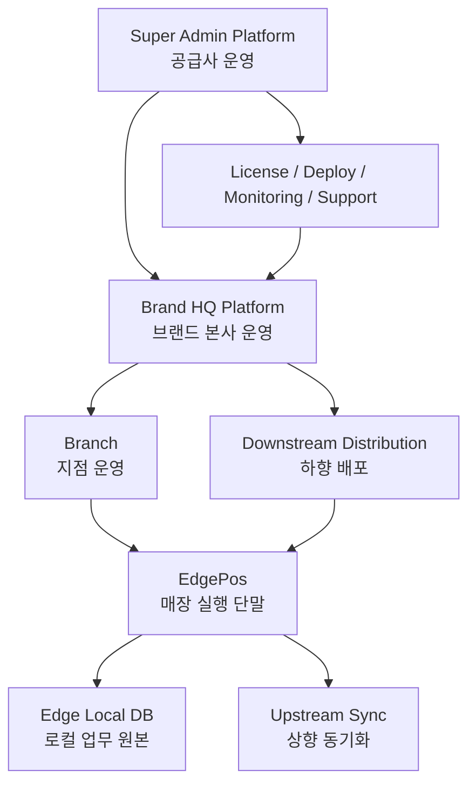
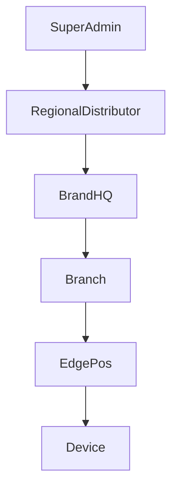
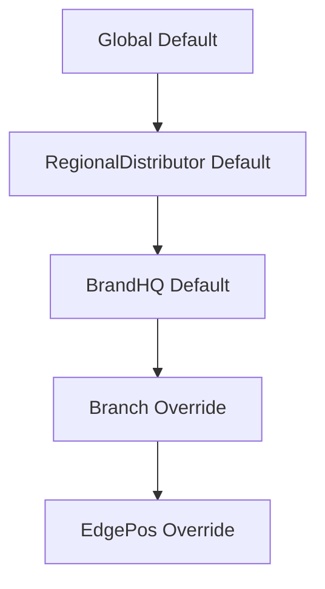
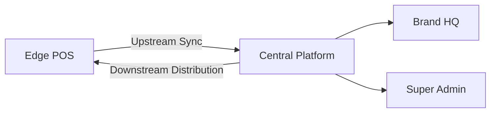

# SuperAdmin 통합 플랫폼 설계서
# Tài liệu thiết kế nền tảng SuperAdmin tích hợp

> 기준 문서:
> 
> - `00-Platform-최종-아키텍처-기준서.md` = Platform 전체 스택 기준서
> - `02-RegionalDistributor-통합유통-플랫폼-설계서.md` = RegionalDistributor 통합유통 설계서
> - `03-BrandHQ-브랜드-지점-운영-플랫폼-설계서.md` = BrandHQ 운영 설계서
> - `04-Edge-POS-아키텍처-설계서.md` = Edge POS 설계서
> - `05-Edge-POS-전체-흐름-AZ-가이드.md` = Edge POS 전체 흐름 설명서
> - `06-Edge-POS-P0-P1-설계-보완-체크리스트.md` = Edge POS 보완 체크리스트
>
> Tài liệu căn cứ:
>
> - `00-Platform-최종-아키텍처-기준서.md` = tài liệu chuẩn stack toàn Platform
> - `02-RegionalDistributor-통합유통-플랫폼-설계서.md` = tài liệu phân phối tích hợp / đại lý
> - `03-BrandHQ-브랜드-지점-운영-플랫폼-설계서.md` = tài liệu vận hành BrandHQ
> - `04-Edge-POS-아키텍처-설계서.md` = tài liệu Edge POS
> - `05-Edge-POS-전체-흐름-AZ-가이드.md` = tài liệu giải thích toàn bộ luồng Edge POS
> - `06-Edge-POS-P0-P1-설계-보완-체크리스트.md` = checklist bổ sung Edge POS

> 이 문서는 **단일 매장 POS 클라이언트 문서가 아니다**.  
> 이 문서는 공급사가 여러 브랜드를 계약·배포·모니터링·지원하는 **최상위 SuperAdmin 플랫폼 설계서**다.
>
> Tài liệu này **không phải tài liệu của một POS đơn lẻ tại cửa hàng**.  
> Đây là tài liệu thiết kế cho **platform SuperAdmin cấp cao nhất** nơi nhà cung cấp quản lý hợp đồng, rollout, monitoring và hỗ trợ nhiều thương hiệu.

---

## 1. 목표 재정의
## 1. Định nghĩa lại mục tiêu

### 한국어

최종 제품은 아래 3개의 층으로 나뉜다.

1. `Edge POS`
   - 각 매장 단말에 설치되는 `.exe`
   - 오프라인 우선
   - 주문, 결제, 테이블, 주방, 장치 제어 담당
2. `Brand HQ Platform`
   - 하나의 브랜드가 여러 지점을 통합 운영하는 관리 플랫폼
   - 메뉴, 가격, 프로모션, 직원, 지점 설정, 리포트 담당
3. `Super Admin Platform`
   - POS 공급사가 여러 브랜드를 운영/감시/배포/지원하는 플랫폼
   - 라이선스, 버전 배포, 장애 모니터링, 원격지원, 감사로그 담당

### Tiếng Việt

Sản phẩm cuối cùng được chia thành 3 tầng như sau.

1. `Edge POS`
   - Chương trình `.exe` cài tại từng EdgePos ở cửa hàng
   - Offline-first
   - Xử lý order, thanh toán, bàn, bếp và thiết bị
2. `Brand HQ Platform`
   - Platform quản trị cho một thương hiệu có nhiều chi nhánh
   - Quản lý menu, giá, khuyến mãi, nhân sự, cài đặt chi nhánh, báo cáo
3. `Super Admin Platform`
   - Platform để nhà cung cấp POS vận hành, giám sát, phân phối và hỗ trợ nhiều thương hiệu
   - Quản lý license, rollout phiên bản, monitoring lỗi, hỗ trợ từ xa và audit log

### 1.1 확정 스펙 / Đặc tả cố định

| 구성 | 확정 SPEC | 계약 / 저장소 | 비고 |
|---|---|---|---|
| `SuperAdmin/Portal` | `Next.js(TypeScript) + App Router + Apollo Client` | GraphQL-first | 공급사 운영 포털 |
| `SuperAdmin/CentralApi` | `NestJS + Fastify + Apollo Server 5` | `Prisma + PostgreSQL + raw SQL/TypedSQL` | 멀티테넌시, RBAC, audit, license, deploy |
| `SuperAdmin/SyncWorkers` | `Node.js(TypeScript) + BullMQ + Redis` | Queue-driven | outbox, retry, reconciliation, notification |
| `SharedContracts` | `TypeScript contract package` | - | 공통 계약 단일 원본 |
| `SharedKernel` | `C++ shared kernel` | - | native helper/protocol |
| `SharedAssets` | runtime static assets | - | static assets only |
| `다국어 / i18n` | `각 프로젝트 내부 i18n` + `i18next` | build-time copy | `SuperAdmin/Portal` UI 문자열/메시지의 공통 원본 |

### 1.2 CentralApi 실행/성능 원칙

#### 한국어

- Redis는 `CentralApi`의 보조 인프라다.
  - cache, distributed lock, rate limit, queue handoff에만 사용한다.
  - 주문/결제/테이블/정산 원본을 Redis에 두지 않는다.
- DataLoader는 Apollo Server resolver에서만 사용한다.
  - request-scoped batch loading과 N+1 방지 목적이다.
  - cross-request cache로 사용하지 않는다.
- 성능 원칙은 아래를 따른다.
  - GraphQL query complexity guard
  - keyset pagination 우선
  - write 후 invalidate/update
  - read model과 source of truth 분리
- 확장성/유지보수 원칙은 아래를 따른다.
  - CentralApi는 초기에는 modular monolith로 유지
  - SyncWorkers는 BullMQ + Redis로 비동기 처리 분리
  - SharedContracts를 단일 계약 원본으로 사용
  - DB 소유권은 Central/PostgreSQL과 Edge/SQLite로 분리
- 현재 구현 기준은 아래를 추가로 따른다.
  - tenant boundary는 resolver 설명이 아니라 service layer scope filter로 강제
  - create/update/delete도 parent ownership 검증 후에만 허용
  - GraphQL depth limit 기본값 `10`
  - GraphQL complexity limit 기본값 `200`
  - production error masking 적용
  - Fastify `helmet/compress/bodyLimit/requestTimeout/keepAliveTimeout/graceful shutdown` 적용
  - Prisma slow query logging 및 pool parameter warning 적용
  - Redis reference cache는 활성화되어 있으며 reference data 목록 캐시에 사용

#### Tiếng Việt

- Redis là hạ tầng bổ trợ của `CentralApi`.
  - Chỉ dùng cho cache, distributed lock, rate limit và queue handoff.
  - Không lưu order/payment/table/settlement source vào Redis.
- DataLoader chỉ dùng ở resolver của Apollo Server.
  - Mục tiêu là batch loading theo request và tránh N+1.
  - Không dùng như cross-request cache.
- Nguyên tắc performance:
  - query complexity guard cho GraphQL
  - ưu tiên keyset pagination
  - write xong phải invalidate/update
  - tách read model khỏi source of truth
- Nguyên tắc scalability/maintainability:
  - CentralApi ban đầu giữ modular monolith
  - SyncWorkers tách xử lý async bằng BullMQ + Redis
  - SharedContracts là single source of truth cho contract
  - Ownership DB tách rõ Central/PostgreSQL và Edge/SQLite
- Chuẩn triển khai hiện tại còn bao gồm:
  - tenant boundary được cưỡng chế ở service layer scope filter, không chỉ mô tả ở resolver
  - create/update/delete chỉ được phép sau khi xác thực parent ownership
  - GraphQL depth limit mặc định `10`
  - GraphQL complexity limit mặc định `200`
  - áp dụng production error masking
  - Fastify có `helmet/compress/bodyLimit/requestTimeout/keepAliveTimeout/graceful shutdown`
  - Prisma có slow query logging và pool parameter warning
  - Redis reference cache đã được bật và dùng cho danh sách reference data

### 1.3 CentralApi 보강 구현 및 검증 상태

#### 한국어

- 반영 완료
  - tenant-aware service layer filtering
  - request-scoped DataLoader + tenant-bound batch loading
  - GraphQL depth/complexity guard
  - production error masking
  - Fastify 보안/압축/timeout/graceful shutdown
  - Prisma slow query logging / pool warning
  - Redis rate limit / distributed lock / stream handoff / reference cache
- 자동 검증 완료
  - `npm run build`
  - `npm test -- --runInBand`
- 테스트 추가
  - `roles.guard.spec.ts`
  - `tenant-scope.spec.ts`
  - `brand.service.spec.ts`
  - `platform-policy.service.spec.ts`
  - `sync.service.spec.ts`
- 구현 완료된 추가 보강
  - `@platform/api-sdk` 초기 패키지 추가 (`SharedContracts/ApiSdk`)
  - `auditLogConnection`, `syncEventConnection` cursor pagination 추가
  - Apollo Persisted Queries 활성화
  - persisted query allow-list manifest 자동 생성 + CentralApi generated allow-list 강제
  - Prisma multi-file schema 전환 (`prisma.config.ts` + `prisma/schema/*.prisma`)
  - SWC builder + typeCheck 전환
- 다음 백로그
  - SDK mutation 범위를 `Branch / EdgePos / DeployRelease` 및 핵심 관리 명령까지 확대
  - Portal 3개가 hand-written Apollo 문서 대신 `@platform/api-sdk` wrapper를 직접 사용하도록 전환
  - production 파이프라인에 allow-list drift 검증과 강제 운영(`GRAPHQL_PERSISTED_QUERY_ALLOW_LIST_ENABLED=true`) 추가

#### Tiếng Việt

- Đã triển khai
  - tenant-aware service layer filtering
  - request-scoped DataLoader + tenant-bound batch loading
  - GraphQL depth/complexity guard
  - production error masking
  - Fastify bảo mật/nén/timeout/graceful shutdown
  - Prisma slow query logging / pool warning
  - Redis rate limit / distributed lock / stream handoff / reference cache
- Đã kiểm chứng tự động
  - `npm run build`
  - `npm test -- --runInBand`
- Test đã thêm
  - `roles.guard.spec.ts`
  - `tenant-scope.spec.ts`
  - `brand.service.spec.ts`
  - `platform-policy.service.spec.ts`
  - `sync.service.spec.ts`
- Hạng mục gia cố đã hoàn thành
  - thêm gói `@platform/api-sdk` ban đầu (`SharedContracts/ApiSdk`)
  - thêm cursor pagination cho `auditLogConnection` và `syncEventConnection`
  - bật Apollo Persisted Queries
  - tự động tạo persisted query allow-list manifest và cưỡng chế allow-list generated tại CentralApi
  - chuyển Prisma sang multi-file schema (`prisma.config.ts` + `prisma/schema/*.prisma`)
  - chuyển builder sang SWC + typeCheck
- Backlog tiếp theo
  - mở rộng phạm vi mutation của SDK sang `Branch / EdgePos / DeployRelease` và các lệnh quản trị chính
  - chuyển 3 portal sang dùng trực tiếp wrapper `@platform/api-sdk` thay cho tài liệu Apollo viết tay
  - thêm kiểm tra drift và cưỡng chế allow-list trong pipeline production (`GRAPHQL_PERSISTED_QUERY_ALLOW_LIST_ENABLED=true`)

---

## 2. 전체 플랫폼 한눈에 보기
## 2. Toàn cảnh platform



### 한국어

핵심은 아래 2문장이다.

- 매장 운영의 실시간 원본은 `Edge POS + Edge Local DB`
- 브랜드/공급사 운영의 통합 원본은 `중앙 플랫폼`

### Tiếng Việt

Điểm cốt lõi có thể tóm lại bằng 2 câu.

- Nguồn thực thi thời gian thực tại cửa hàng là `Edge POS + Edge Local DB`
- Nguồn quản trị tích hợp ở cấp thương hiệu và nhà cung cấp là `platform trung tâm`

---

## 3. 멀티테넌시 계층 모델
## 3. Mô hình phân cấp multi-tenancy



### 한국어

멀티테넌시의 최소 단위는 아래와 같이 정의한다.

- `SuperAdmin`
  - 플랫폼 공급사 운영 주체
- `RegionalDistributor`
  - 국가/지역 독점 유통권을 가진 대리점/채널 파트너
- `BrandHQ`
  - 브랜드 본사 운영 테넌트
- `Branch`
  - 브랜드 산하의 개별 매장/지점
- `EdgePos`
  - 지점에 설치된 POS 실행 단말
- `Device`
  - 프린터, 카드리더기, 스캐너, 저울 등 단말 부속 장치

이 모델에서 가장 중요한 원칙은 아래와 같다.

- `SuperAdmin`은 플랫폼 운영 주체다
- `RegionalDistributor`는 채널/계약/지원 계층이다
- `BrandHQ`는 브랜드의 운영 원본이다
- `Branch`는 독립 운영 단위다
- `EdgePos`는 거래 실행 단위다
- `Device`는 `EdgePos`에 귀속된다
- 하나의 `EdgePos`는 하나의 `BrandHQ`와 하나의 `Branch`에만 귀속된다

### Tiếng Việt

Đơn vị tối thiểu của multi-tenancy được định nghĩa như sau.

- `SuperAdmin`
  - chủ thể vận hành của nhà cung cấp platform
- `RegionalDistributor`
  - đại lý/đối tác kênh có quyền phân phối độc quyền theo quốc gia/khu vực
- `BrandHQ`
  - tenant vận hành cấp trụ sở thương hiệu
- `Branch`
  - cửa hàng/chi nhánh trực thuộc thương hiệu
- `EdgePos`
  - EdgePos được cài tại chi nhánh
- `Device`
  - thiết bị ngoại vi kết nối với EdgePos

Những nguyên tắc quan trọng nhất của mô hình này là.

- `SuperAdmin` là chủ thể vận hành platform
- `RegionalDistributor` là tầng kênh/hợp đồng/hỗ trợ
- `BrandHQ` là nguồn vận hành của thương hiệu
- `Branch` là đơn vị vận hành độc lập
- `EdgePos` là đơn vị thực thi giao dịch
- `Device` thuộc về `EdgePos`
- Một `EdgePos` chỉ thuộc một `BrandHQ` và một `Branch`

---

## 4. 핵심 식별자
## 4. Định danh cốt lõi

### 한국어

모든 중앙 플랫폼 데이터와 Edge POS 데이터는 아래 식별자를 공통으로 가져야 한다.

- `SuperAdminId`
- `RegionalDistributorId`
- `BrandHQId`
- `BranchId`
- `EdgePosId`
- `OperatorId`
- `DeviceId`
- `PolicyVersion`
- `CatalogVersion`
- `SyncCursor`

이 식별자가 없으면 아래 문제가 생긴다.

- 어느 `BrandHQ` 데이터인지 구분 불가
- 어느 지점 매출인지 집계 불가
- 어떤 `EdgePos`가 장애를 일으켰는지 추적 불가
- 어떤 메뉴 버전이 배포됐는지 검증 불가

### Tiếng Việt

Mọi dữ liệu của platform trung tâm và Edge POS phải chia sẻ các định danh chung sau.

- `SuperAdminId`
- `RegionalDistributorId`
- `BrandHQId`
- `BranchId`
- `EdgePosId`
- `OperatorId`
- `DeviceId`
- `PolicyVersion`
- `CatalogVersion`
- `SyncCursor`

Nếu không có các định danh này, các vấn đề sau sẽ xảy ra.

- Không phân biệt được dữ liệu thuộc `BrandHQ` nào
- Không thể tổng hợp doanh thu theo chi nhánh
- Không thể truy vết EdgePos nào gây lỗi
- Không thể xác minh version menu hoặc policy đã được phân phối

---

## 5. 데이터 소유권 재정의
## 5. Định nghĩa lại quyền sở hữu dữ liệu

### 5.1 로컬 원본 / Nguồn gốc local

#### 한국어

아래 데이터는 매장 Edge POS와 Edge Local DB가 원본이다.

- 실시간 테이블 상태
- 진행 중 주문
- 결제 진행 상태
- 영수증/주방 출력 상태
- 장치 연결 상태
- 오프라인 큐와 복구 상태

#### Tiếng Việt

Các dữ liệu sau có nguồn gốc chính tại Edge POS và Edge Local DB.

- Trạng thái bàn theo thời gian thực
- Đơn hàng đang diễn ra
- Trạng thái xử lý thanh toán
- Trạng thái in hóa đơn và in bếp
- Trạng thái kết nối thiết bị
- Queue offline và trạng thái phục hồi

### 5.2 브랜드 중앙 원본 / Nguồn gốc trung tâm của thương hiệu

#### 한국어

아래 데이터는 Brand HQ Platform이 원본이다.

- 메뉴 마스터
- 가격 정책
- 프로모션 정책
- 지점 운영 정책
- 직원/권한 템플릿
- 브랜드 공지
- 리포트/정산 기준

#### Tiếng Việt

Các dữ liệu sau có nguồn gốc chính tại Brand HQ Platform.

- Menu master
- Chính sách giá
- Chính sách khuyến mãi
- Chính sách vận hành chi nhánh
- Template nhân sự và phân quyền
- Thông báo toàn thương hiệu
- Tiêu chuẩn báo cáo và đối soát

### 5.3 공급사 중앙 원본 / Nguồn gốc trung tâm của nhà cung cấp

#### 한국어

아래 데이터는 Super Admin Platform이 원본이다.

- 브랜드 계약/라이선스
- POS 버전 배포 정책
- 기능 플래그
- 원격 지원 권한
- 전체 장애 현황
- 글로벌 감사 로그

#### Tiếng Việt

Các dữ liệu sau có nguồn gốc chính tại Super Admin Platform.

- Hợp đồng thương hiệu và license
- Chính sách rollout version POS
- Feature flags toàn cục
- Quyền hỗ trợ từ xa
- Tình trạng lỗi toàn hệ thống
- Audit log toàn cục

---

## 6. 설정 상속 모델
## 6. Mô hình kế thừa cấu hình



### 한국어

설정은 아래 우선순위로 적용한다.

1. `Global Default`
2. `RegionalDistributor Default`
3. `BrandHQ Default`
4. `Branch Override`
5. `EdgePos Override`

이 모델을 쓰는 이유는 브랜드가 수십 개 지점, 수백 개 단말을 가져도 설정이 폭발하지 않게 하기 위해서다.

대표 적용 대상:

- 세금 정책
- 메뉴 가격
- 할인 정책
- 프린터 라우팅
- 결제 수단 사용 가능 여부
- UI 기능 플래그

### Tiếng Việt

Cấu hình được áp dụng theo thứ tự ưu tiên sau.

1. `Global Default`
2. `RegionalDistributor Default`
3. `BrandHQ Default`
4. `Branch Override`
5. `EdgePos Override`

Lý do dùng mô hình này là để tránh việc cấu hình bùng nổ khi một thương hiệu có hàng chục chi nhánh và hàng trăm EdgePos.

Các đối tượng áp dụng điển hình:

- Chính sách thuế
- Giá menu
- Chính sách giảm giá
- Routing máy in
- Khả năng sử dụng phương thức thanh toán
- Feature flag của UI

---

## 7. 상향 동기화와 하향 배포
## 7. Đồng bộ lên và phân phối xuống

### 한국어

통합 플랫폼에서는 동기화를 아래 2종으로 분리해야 한다.

#### Upstream Sync

- 매장 Edge POS → 중앙 플랫폼
- 매출, 주문, 정산, 운영 이벤트, 장치 상태, 로그 업로드

#### Downstream Distribution

- 중앙 플랫폼 → 매장 Edge POS
- 메뉴, 가격, 정책, 기능 플래그, 공지, 배포 버전 전달

### Tiếng Việt

Trong platform tích hợp, phải tách đồng bộ thành 2 loại.

#### Upstream Sync

- Từ Edge POS tại cửa hàng -> platform trung tâm
- Upload doanh thu, đơn hàng, đối soát, sự kiện vận hành, trạng thái thiết bị, log

#### Downstream Distribution

- Từ platform trung tâm -> Edge POS tại cửa hàng
- Phân phối menu, giá, policy, feature flag, thông báo, version triển khai



---

## 8. 동기화 구조 상세
## 8. Cấu trúc đồng bộ chi tiết

### 8.1 상향 동기화 / Đồng bộ hướng lên

#### 한국어

상향 동기화는 아래 순서를 따른다.

1. 로컬 DB 커밋 완료
2. `OutboxStore` 적재
3. `SyncWorker` 또는 dispatcher가 중앙 API로 송신
4. 중앙 플랫폼이 수신 후 tenant 검증
5. 브랜드/지점/단말 기준으로 저장
6. ACK 또는 재시도 상태 반환

#### Tiếng Việt

Đồng bộ hướng lên đi theo thứ tự sau.

1. Commit local DB hoàn tất
2. Ghi vào `OutboxStore`
3. `SyncWorker` hoặc dispatcher gửi đến API trung tâm
4. Platform trung tâm xác thực tenant
5. Lưu dữ liệu theo `RegionalDistributor`, `BrandHQ`, `Branch`, `EdgePos`
6. Trả về ACK hoặc trạng thái retry

### 8.2 하향 배포 / Phân phối hướng xuống

#### 한국어

하향 배포는 아래 순서를 따른다.

1. 중앙 플랫폼에서 정책/메뉴/설정 version 생성
2. `RegionalDistributor` 또는 `BrandHQ` 또는 `Branch` 범위로 배포 대상 계산
3. `EdgePos` 대상 distribution queue 생성
4. Edge POS가 pull 또는 push-notify 방식으로 새 버전 확인
5. 로컬 적용 전 무결성 검증
6. 적용 성공 시 `AppliedVersion` ACK
7. 실패 시 rollback 또는 quarantine

#### Tiếng Việt

Phân phối hướng xuống đi theo thứ tự sau.

1. Tạo version mới cho policy, menu hoặc cấu hình ở platform trung tâm
2. Tính toán phạm vi áp dụng theo `RegionalDistributor`, `BrandHQ` hoặc `Branch`
3. Tạo distribution queue theo từng `EdgePos`
4. Edge POS kiểm tra version mới bằng pull hoặc push-notify
5. Kiểm tra tính toàn vẹn trước khi áp dụng local
6. Khi áp dụng thành công, gửi ACK `AppliedVersion`
7. Khi thất bại, rollback hoặc đưa vào trạng thái quarantine

---

## 9. 중앙 플랫폼의 최소 도메인
## 9. Domain tối thiểu của platform trung tâm

### 한국어

최소한 아래 도메인이 필요하다.

- `Identity`
  - 사용자, 역할, 권한, 세션
- `Tenant Management`
  - `RegionalDistributor`, `BrandHQ`, `Branch`, `EdgePos` 등록/관리
- `Catalog Management`
  - 메뉴, 카테고리, 가격, 옵션
- `Policy Management`
  - 세금, 할인, 영업 설정, 기능 플래그
- `Operations`
  - 동기화 상태, 배포 상태, 장애 현황
- `Reporting`
  - 매출, 정산, 운영 리포트
- `Support`
  - 원격 지원, 감사 로그, 배포 제어

### Tiếng Việt

Cần tối thiểu các domain sau.

- `Identity`
  - Người dùng, role, quyền, session
- `Tenant Management`
  - Đăng ký và quản lý `RegionalDistributor`, `BrandHQ`, `Branch`, `EdgePos`
- `Catalog Management`
  - Menu, category, giá, option
- `Policy Management`
  - Thuế, giảm giá, cấu hình vận hành, feature flag
- `Operations`
  - Trạng thái sync, trạng thái rollout, tình trạng lỗi
- `Reporting`
  - Doanh thu, đối soát, báo cáo vận hành
- `Support`
  - Hỗ trợ từ xa, audit log, điều khiển triển khai

---

## 10. 권한 모델
## 10. Mô hình phân quyền

| 역할 | 한국어 책임 | Trách nhiệm tiếng Việt |
|---|---|---|
| `PlatformSuperAdmin` | 여러 브랜드 생성, 정지, 배포, 지원 | Tạo, khóa, triển khai và hỗ trợ nhiều thương hiệu |
| `PlatformSupportEngineer` | 장애 분석, 원격 지원, 로그 열람 | Phân tích sự cố, hỗ trợ từ xa, xem log |
| `BrandOwner` | 브랜드 전체 정책 승인 | Phê duyệt chính sách toàn thương hiệu |
| `BrandHQAdmin` | 브랜드 메뉴/가격/정책 관리 | Quản lý menu, giá và policy của thương hiệu |
| `BrandHQOperator` | 본사 리포트/정산 운영 | Vận hành báo cáo và đối soát tại HQ |
| `BranchManager` | 자기 지점 운영 관리 | Quản lý vận hành chi nhánh của mình |
| `StoreOperator` | POS 현장 사용 | Người dùng trực tiếp tại cửa hàng |

### 한국어

중요 원칙:

- `SuperAdmin` 권한은 브랜드 데이터 전체 열람권과 동일하지 않다
- 민감 데이터 열람은 감사 로그와 승인 절차를 거쳐야 한다
- 브랜드 간 데이터는 tenant boundary로 격리한다

### Tiếng Việt

Nguyên tắc quan trọng:

- Quyền `SuperAdmin` không đồng nghĩa với việc tự do xem toàn bộ dữ liệu chi tiết của mọi thương hiệu
- Việc truy cập dữ liệu nhạy cảm phải đi qua audit log và quy trình phê duyệt
- Dữ liệu giữa các thương hiệu phải được cách ly bằng tenant boundary

---

## 11. Edge POS와 중앙 플랫폼의 책임 경계
## 11. Ranh giới trách nhiệm giữa Edge POS và platform trung tâm

| 구분 | Edge POS | Brand HQ / Super Admin |
|---|---|---|
| 주문 처리 | 실시간 처리 | 집계/조회 |
| 결제 처리 | 실시간 처리 | 리포트/정산 기준 |
| 테이블 상태 | 로컬 원본 | 요약/모니터링 |
| 메뉴 표시 | 내려받은 정책 사용 | 메뉴 원본 관리 |
| 기능 플래그 | 로컬 적용 | 글로벌/브랜드 정책 원본 |
| 장애 대응 | 현장 재시도/복구 | 원격 모니터링/지원 |
| 동기화 | 업로드/적용 실행 | 배포/수신/중앙 저장 |

### 한국어

한 줄로 요약하면:

- Edge POS는 **실행 엔진**
- 중앙 플랫폼은 **통합 제어 및 정책 엔진**

### Tiếng Việt

Tóm lại bằng một câu:

- Edge POS là **execution engine**
- Platform trung tâm là **control và policy engine**

---

## 12. 권장 프로젝트 구조
## 12. Cấu trúc dự án được khuyến nghị

```text
Platform/
├── BrandPosApp/          # Edge POS chính + Setup/Maintenance mode / 메인 Edge POS + 설정/유지보수 모드
├── RegionalDistributorPortal/   # 대리점/통합유통 전용 Web 프로젝트
├── BrandHQPortal/        # Web quản trị thương hiệu / 브랜드 본사 관리 웹
├── SuperAdmin/
│   ├── Portal/           # Web 공급사 운영 / 공급사 슈퍼관리자 웹
│   ├── CentralApi/       # API trung tâm / 중앙 API
│   └── SyncWorkers/      # Worker đồng bộ/배포 / 동기화/배포 워커
├── SharedKernel/         # Module C++ dùng chung / 공용 C++ 모듈
├── SharedContracts/      # Contract dùng chung / 공통 계약
└── SharedAssets/         # Tài sản dùng chung / 공용 자산
```

### 한국어

현재 repo는 `BrandPosApp`, `RegionalDistributorPortal`, `BrandHQPortal`, `SuperAdmin`, `SharedKernel`, `SharedContracts`, `SharedAssets`, `1.Docs` 중심이지만, 장기적으로는 위와 같이 상위 플랫폼 컴포넌트가 정리되어야 한다. `BrandPosApp` 내부에는 POS mode와 Setup/Maintenance mode가 함께 존재한다.

### Tiếng Việt

Repo hiện tại đang tập trung vào `BrandPosApp`, `RegionalDistributorPortal`, `BrandHQPortal`, `SuperAdmin`, `SharedKernel`, `SharedContracts`, `SharedAssets`, `1.Docs`, nhưng về dài hạn cần mở rộng thêm các thành phần platform phía trên như sơ đồ trên. `BrandPosApp` bao gồm cả POS mode và Setup/Maintenance mode.

---

## 13. 대표 운영 시나리오
## 13. Kịch bản vận hành tiêu biểu

### 13.1 본사에서 메뉴 배포 / HQ phân phối menu

```text
BrandHQ
→ Catalog Management
→ CatalogVersion 생성
→ Branch/EdgePos distribution queue 생성
→ Edge POS 다운로드
→ 로컬 검증
→ 적용 완료 ACK
```

### 13.2 매장에서 매출 발생 / Doanh thu phát sinh tại cửa hàng

```text
Edge POS
→ 로컬 DB commit
→ OutboxStore enqueue
→ Upstream Sync
→ Central Platform ingest
→ Brand HQ dashboard update
→ Super Admin health/usage aggregate
```

### 13.3 공급사가 버전 배포 / Nhà cung cấp rollout version

```text
SuperAdmin
→ rollout policy 생성
→ BrandHQ / Branch / EdgePos 대상 계산
→ phased deployment
→ health monitor
→ rollback or expand
```

---

## 14. 문서 관계
## 14. Quan hệ giữa các tài liệu

### 한국어

- `01` 문서는 **공급사/슈퍼관리자 및 유통 파트너 관점 플랫폼**
- `02` 문서는 **브랜드 본사/지점 운영 관점 플랫폼**
- `03` 문서는 **매장 EdgePos 내부 아키텍처**
- `04` 문서는 **매장 EdgePos 실제 동작 흐름**

즉 `01`은 “공급사와 지역 유통 파트너가 여러 브랜드를 어떻게 통제·배포·지원하는가”를 설명하고, `02`는 “브랜드 본사가 여러 지점을 어떻게 운영하는가”, `03`과 `04`는 “한 지점의 EdgePos가 어떻게 움직이는가”를 설명한다.

### Tiếng Việt

- Tài liệu `01` mô tả **platform ở góc nhìn nhà cung cấp / super admin**
- Tài liệu `02` mô tả **platform ở góc nhìn vận hành brand/branch**
- Tài liệu `03` mô tả **kiến trúc bên trong EdgePos tại cửa hàng**
- Tài liệu `04` mô tả **luồng vận hành thực tế của EdgePos**

Nói cách khác, `01` giải thích “nhà cung cấp điều phối nhiều brand như thế nào”, `02` giải thích “một brand quản lý nhiều chi nhánh ra sao”, còn `03` và `04` giải thích “một EdgePos vận hành như thế nào”.

---

## 15. 최종 원칙
## 15. Nguyên tắc cuối cùng

### 한국어

1. EdgePos와 중앙 플랫폼은 같은 제품군이지만 책임이 다르다.
2. 실시간 업무 원본은 로컬에 두고, 정책 원본은 중앙에 둔다.
3. 멀티테넌시는 `RegionalDistributor → BrandHQ → Branch → EdgePos` 경계를 기준으로 설계한다.
4. 상향 동기화와 하향 배포를 명확히 분리한다.
5. 슈퍼관리자는 운영 통제권을 가지되, 브랜드 데이터 접근은 감사 가능하게 제한한다.

### Tiếng Việt

1. EdgePos và platform trung tâm thuộc cùng một product family nhưng có trách nhiệm khác nhau.
2. Nguồn dữ liệu thực thi thời gian thực ở local, còn nguồn policy ở trung tâm.
3. Multi-tenancy phải được thiết kế theo ranh giới `RegionalDistributor -> BrandHQ -> Branch -> EdgePos`.
4. Phải tách rõ đồng bộ hướng lên và phân phối hướng xuống.
5. Super Admin có quyền điều phối vận hành, nhưng truy cập dữ liệu thương hiệu phải bị giới hạn và có audit.
