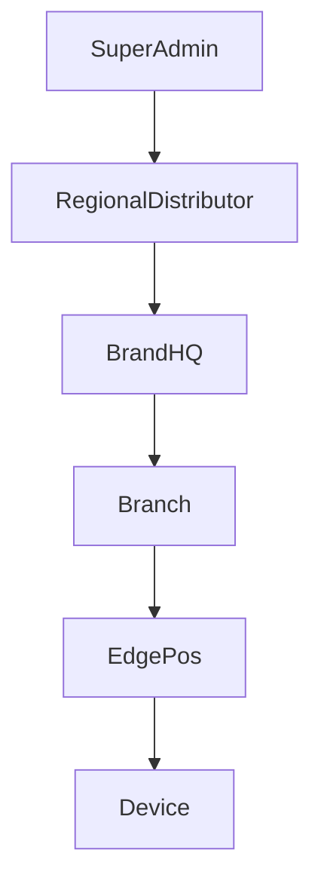

# RegionalDistributor 통합유통 플랫폼 설계서
# Tài liệu thiết kế nền tảng phân phối tích hợp RegionalDistributor

> 기준 문서:
>
> - `00-Platform-최종-아키텍처-기준서.md` = 전체 플랫폼 최상위 스택 기준서
> - `01-SuperAdmin-통합-플랫폼-설계서.md` = 공급사/슈퍼관리자 상위 플랫폼 설계서
> - `03-BrandHQ-브랜드-지점-운영-플랫폼-설계서.md` = 브랜드 본사/지점 운영 설계서
> - `04-Edge-POS-아키텍처-설계서.md` = 매장 Edge POS 내부 설계서

> Tài liệu căn cứ:
>
> - `00-Platform-최종-아키텍처-기준서.md` = tài liệu chuẩn stack cao nhất của toàn Platform
> - `01-SuperAdmin-통합-플랫폼-설계서.md` = tài liệu platform cấp nhà cung cấp / super admin
> - `03-BrandHQ-브랜드-지점-운영-플랫폼-설계서.md` = tài liệu vận hành brand HQ / chi nhánh
> - `04-Edge-POS-아키텍처-설계서.md` = tài liệu kiến trúc bên trong Edge POS tại cửa hàng

> 이 문서는 **대리점/통합유통 계층**이 무엇을 소유하고 무엇을 관리하지 않는지 정의한다.
> `RegionalDistributor`는 브랜드 본사나 매장 POS가 아니라, **국가/지역 단위 유통권과 배포 책임을 가진 채널 파트너 계층**이다.
>
> Tài liệu này định nghĩa rõ `RegionalDistributor` sở hữu gì và không sở hữu gì.
> `RegionalDistributor` không phải brand HQ hay POS cửa hàng, mà là **tầng đối tác kênh có quyền phân phối và trách nhiệm rollout theo quốc gia/khu vực**.

---

## 1. 목적
## 1. Mục đích

### 한국어

`RegionalDistributor` 계층의 목적은 아래 5가지다.

1. 국가/지역 단위의 독점 유통권을 모델링한다.
2. 공급사와 브랜드 본사 사이의 계약/라이선스/배포 경계를 분리한다.
3. 지역별 규제, 세금, 언어, 결제수단, 지원 정책을 지역 단위로 관리한다.
4. 브랜드 온보딩과 매장 롤아웃을 현지 파트너 관점에서 추적한다.
5. `SuperAdmin -> RegionalDistributor -> BrandHQ -> Branch -> EdgePos` 체계를 문서와 DB 식별자에 반영한다.

### Tiếng Việt

Mục tiêu của tầng `RegionalDistributor` gồm 5 điểm.

1. Mô hình hóa quyền phân phối độc quyền theo quốc gia/khu vực.
2. Tách ranh giới hợp đồng/license/phân phối giữa nhà cung cấp và brand HQ.
3. Quản lý theo vùng các quy định, thuế, ngôn ngữ, phương thức thanh toán và chính sách hỗ trợ.
4. Theo dõi onboarding brand và rollout cửa hàng từ góc nhìn đối tác địa phương.
5. Phản ánh chuỗi `SuperAdmin -> RegionalDistributor -> BrandHQ -> Branch -> EdgePos` vào tài liệu và định danh DB.

### 1.1 확정 스펙 / Đặc tả cố định

| 구성 | 확정 SPEC | 계약 / 저장소 | 비고 |
|---|---|---|---|
| `RegionalDistributorPortal` | `Next.js(TypeScript) + App Router + Apollo Client` | GraphQL-first | 대리점/통합유통 전용 Web 프로젝트 |
| 중앙 연결 | `SuperAdmin/CentralApi` | GraphQL API | 계약/라이선스/배포/정산 데이터 조회 |
| UI 상태 | `Redux Toolkit` 필요 시 사용 | - | 화면 상태, 폼, 필터 |
| 다국어 / i18n | `SharedAssets/i18n/locales` + `i18next` | build-time copy | `RegionalDistributorPortal` UI 문자열/메시지의 공통 원본 |
| 직접 DB 접근 | 없음 | - | 모든 영속 데이터는 중앙 API 경유 |
| 공통 계약 | `SharedContracts` | TypeScript DTO | 권한/territory/license schema |
| 로그/감사 | `SuperAdmin/CentralApi` | audit log | 대리점 활동 추적 |

### 1.2 실행/성능/유지보수 원칙

#### 한국어

- 서버 상태는 `Apollo Client`가 담당한다.
- `Redux Toolkit`은 화면 상태, 폼, 필터, wizard 같은 UI 상태에만 한정한다.
- `Redis`와 `DataLoader`는 포털이 직접 쓰지 않는다.
  - Redis는 `SuperAdmin/CentralApi`와 worker가 책임진다.
  - DataLoader는 Apollo Server resolver의 서버 측 책임이다.
- 대량 목록은 pagination, lazy loading, fragment 분리로 처리한다.
- `SharedContracts`를 DTO/enum/event의 단일 원본으로 사용한다.
- `SharedAssets/i18n/locales`를 번역 원본으로 사용한다.
- 유지보수 원칙:
  - distributor/territory/license/rollout 도메인별로 feature를 분리한다.
  - 화면별 서버 상태를 Redux에 중복 저장하지 않는다.
  - query/mutation/component를 동일 domain scope 안에 co-locate한다.

#### Tiếng Việt

- Trạng thái server do `Apollo Client` phụ trách.
- `Redux Toolkit` chỉ dùng cho trạng thái UI như màn hình, form, filter, wizard.
- Portal không dùng trực tiếp `Redis` và `DataLoader`.
  - Redis do `SuperAdmin/CentralApi` và worker phụ trách.
  - DataLoader là trách nhiệm phía server của Apollo Server resolver.
- Danh sách lớn phải xử lý bằng pagination, lazy loading và tách fragment.
- Dùng `SharedContracts` làm nguồn gốc duy nhất cho DTO/enum/event.
- Dùng `SharedAssets/i18n/locales` làm nguồn dịch.
- Nguyên tắc maintainability:
  - Tách feature theo domain distributor/territory/license/rollout.
  - Không lưu trùng server state vào Redux.
  - Co-locate query/mutation/component trong cùng domain scope.

---

## 2. 책임 위치
## 2. Vị trí trách nhiệm



### 한국어

핵심 책임은 다음과 같이 구분한다.

- `SuperAdmin`
  - 플랫폼 공급사 전체 통제
  - 글로벌 라이선스/정책/감사
- `RegionalDistributor`
  - 지역/국가 독점 유통권
  - 현지 계약, 배포, 지원 조율
  - 지역 정책/제약 반영
- `BrandHQ`
  - 브랜드 본사 운영
  - 메뉴, 가격, 프로모션, 지점 정책
- `Branch`
  - 실제 매장 운영 단위
- `EdgePos`
  - 매장 실시간 거래 실행 단위
- `Device`
  - 프린터, 카드리더기, 스캐너 등 주변기기

### Tiếng Việt

Phân chia trách nhiệm như sau.

- `SuperAdmin`
  - kiểm soát toàn bộ platform provider
  - license/chính sách/audit toàn cầu
- `RegionalDistributor`
  - quyền phân phối độc quyền theo khu vực/quốc gia
  - điều phối hợp đồng, rollout, hỗ trợ tại địa phương
  - phản ánh các chính sách/ràng buộc theo vùng
- `BrandHQ`
  - vận hành trụ sở thương hiệu
  - menu, giá, khuyến mãi, chính sách chi nhánh
- `Branch`
  - đơn vị vận hành cửa hàng thực tế
- `EdgePos`
  - đơn vị thực thi giao dịch thời gian thực tại cửa hàng
- `Device`
  - thiết bị ngoại vi như printer, card reader, scanner

---

## 3. 관리 범위
## 3. Phạm vi quản lý

### 한국어

`RegionalDistributor`가 직접 관리하는 범위는 아래와 같다.

- 지역/국가 독점 유통권
- 브랜드 계약 상태
- 라이선스 수량/만료/배포 가능 범위
- 현지 지원 SLA
- 지역별 공지/배포 정책
- 지역별 규제 대응 설정
- 브랜드 온보딩 진행 상태
- 배포/지원/정산 추적

`RegionalDistributor`가 직접 소유하지 않는 범위는 아래와 같다.

- 브랜드 메뉴/가격 원본
- 지점 주문/결제의 실시간 원본
- EdgePos 로컬 DB의 거래 원본
- 매장 운영자 출근/실명 관리 원본

### Tiếng Việt

Phạm vi mà `RegionalDistributor` quản lý trực tiếp gồm.

- quyền phân phối độc quyền theo khu vực/quốc gia
- trạng thái hợp đồng của brand
- số lượng / hết hạn / phạm vi license được phép phân phối
- SLA hỗ trợ tại địa phương
- chính sách thông báo / phân phối theo vùng
- cấu hình xử lý các yêu cầu pháp lý theo vùng
- tiến độ onboarding brand
- theo dõi rollout / support / settlement

Phạm vi mà `RegionalDistributor` không sở hữu trực tiếp gồm.

- nguồn gốc menu / giá của brand
- nguồn gốc thời gian thực của order / thanh toán ở chi nhánh
- nguồn gốc giao dịch trong EdgePos local DB
- nguồn gốc dữ liệu nhân sự / chấm công / danh tính vận hành cửa hàng

---

## 4. 데이터 소유권
## 4. Quyền sở hữu dữ liệu

### 4.1 RegionalDistributor 원본
### 4.1 Nguồn gốc của RegionalDistributor

#### 한국어

아래 데이터는 `RegionalDistributor`가 원본 또는 상위 기준을 가진다.

- `RegionalDistributorId`
- `TerritoryCode`
- `CountryCode`
- `ContractId`
- `LicensePoolId`
- `RolloutBatchId`
- `SupportSlaId`
- `DistributorUserId`
- `SettlementBatchId`

#### Tiếng Việt

Các dữ liệu sau có nguồn gốc hoặc chuẩn quản trị ở tầng `RegionalDistributor`.

- `RegionalDistributorId`
- `TerritoryCode`
- `CountryCode`
- `ContractId`
- `LicensePoolId`
- `RolloutBatchId`
- `SupportSlaId`
- `DistributorUserId`
- `SettlementBatchId`

### 4.2 BrandHQ 원본과의 경계
### 4.2 Ranh giới với BrandHQ

#### 한국어

`RegionalDistributor`는 아래 원본을 직접 소유하지 않는다.

- 메뉴 마스터
- 가격 원본
- 지점 실시간 주문 원본
- 결제 승인 원본
- 테이블 점유 상태 원본

이 데이터는 각각 `BrandHQ` 또는 `EdgePos`가 원본이다.

#### Tiếng Việt

`RegionalDistributor` không sở hữu trực tiếp các nguồn sau.

- menu master
- nguồn gốc giá
- nguồn gốc order thời gian thực ở chi nhánh
- nguồn gốc phê duyệt thanh toán
- nguồn gốc trạng thái chiếm bàn

Các dữ liệu này thuộc `BrandHQ` hoặc `EdgePos`.

---

## 5. 설정 상속 모델
## 5. Mô hình kế thừa cấu hình

### 한국어

전사/지역/브랜드/지점/단말 설정은 아래 순서로 평가한다.

1. `Global Default`
2. `RegionalDistributor Default`
3. `BrandHQ Default`
4. `Branch Override`
5. `EdgePos Override`

규칙:

- 지역 규제나 결제사 제한은 `RegionalDistributor Default`에 둔다.
- 브랜드 고유 정책은 `BrandHQ Default`에 둔다.
- 지점/단말별 예외는 override로 제한한다.
- 어떤 값이 어느 계층에서 왔는지 추적 가능해야 한다.

### Tiếng Việt

Cấu hình toàn cục / theo vùng / theo brand / theo chi nhánh / theo EdgePos được đánh giá theo thứ tự sau.

1. `Global Default`
2. `RegionalDistributor Default`
3. `BrandHQ Default`
4. `Branch Override`
5. `EdgePos Override`

Quy tắc:

- Ràng buộc pháp lý hoặc giới hạn payment theo vùng đặt ở `RegionalDistributor Default`.
- Chính sách riêng của brand đặt ở `BrandHQ Default`.
- Ngoại lệ theo chi nhánh / thiết bị phải được giới hạn ở override.
- Phải truy vết được giá trị đến từ tầng nào.

---

## 6. 배포와 온보딩
## 6. Phân phối và onboarding

### 한국어

`RegionalDistributor`는 다음 3가지 흐름의 중간 허브다.

1. 브랜드 온보딩
   - 계약 등록
   - 지역권 확인
   - 라이선스 할당
2. 하향 배포
   - 정책, 카탈로그, 지역 규제, 지원 템플릿 전달
3. 상향 보고
   - rollout 결과
   - 장애 요약
   - 정산/지원 상태

```text
SuperAdmin
→ RegionalDistributor
→ BrandHQ
→ Branch
→ EdgePos
```

### Tiếng Việt

`RegionalDistributor` là hub trung gian cho 3 luồng.

1. Onboarding brand
   - đăng ký hợp đồng
   - xác nhận quyền khu vực
   - cấp license
2. Phân phối xuống
   - policy, catalog, quy định vùng, template hỗ trợ
3. Báo cáo lên
   - kết quả rollout
   - tóm tắt sự cố
   - trạng thái settlement / support

```text
SuperAdmin
→ RegionalDistributor
→ BrandHQ
→ Branch
→ EdgePos
```

---

## 7. 권한 모델
## 7. Mô hình quyền

### 한국어

`RegionalDistributor` 계층에 필요한 최소 권한은 아래와 같다.

- `DistributorAdmin`
  - 지역/계약/배포 전체 관리
- `DistributorManager`
  - 브랜드 온보딩/지원/상태 조회
- `DistributorSupport`
  - 장애 티켓/원격지원/롤아웃 추적

권한 원칙:

- `SuperAdmin`은 전역 정책을 변경할 수 있다.
- `RegionalDistributor`는 자기 지역의 브랜드만 관리할 수 있다.
- `BrandHQ`는 자기 브랜드의 지점만 관리할 수 있다.
- `Branch`와 `EdgePos`의 운영 데이터는 하위 계층이 소유한다.

### Tiếng Việt

Các quyền tối thiểu cho tầng `RegionalDistributor`:

- `DistributorAdmin`
  - quản lý toàn bộ khu vực / hợp đồng / rollout
- `DistributorManager`
  - onboarding brand / support / xem trạng thái
- `DistributorSupport`
  - ticket sự cố / hỗ trợ từ xa / theo dõi rollout

Nguyên tắc quyền:

- `SuperAdmin` có thể thay đổi chính sách toàn cầu.
- `RegionalDistributor` chỉ quản lý brand trong khu vực của mình.
- `BrandHQ` chỉ quản lý chi nhánh của brand mình.
- Dữ liệu vận hành của `Branch` và `EdgePos` thuộc về tầng thấp hơn.

---

## 8. 중앙 시스템과의 관계
## 8. Quan hệ với hệ thống trung tâm

### 한국어

이 계층은 별도 실행 앱보다 **중앙 플랫폼 내 역할/경계**로 먼저 정의한다.

- 실제 운영 UI는 `RegionalDistributorPortal`이라는 별도 Web 프로젝트로 구현한다.
- API와 권한, 감사로그는 `SuperAdmin/CentralApi`가 책임진다.
- 롤아웃 큐, 재시도, 배포 후속 처리는 `SuperAdmin/SyncWorkers`가 책임진다.
- `RegionalDistributorPortal`은 선택 사항이 아니라 정식 Web 프로젝트다.

### Tiếng Việt

Tầng này được định nghĩa trước hết như **role / boundary trong platform trung tâm**, và có một web project riêng chính thức.

- UI vận hành thực tế được triển khai trong `RegionalDistributorPortal` như một web project riêng.
- API, quyền và audit log do `SuperAdmin/CentralApi` phụ trách.
- Queue rollout, retry và xử lý hậu phân phối do `SuperAdmin/SyncWorkers` phụ trách.
- `RegionalDistributorPortal` không phải tùy chọn tương lai mà là web project chính thức.

---

## 9. 권장 프로젝트 구조
## 9. Cấu trúc dự án được khuyến nghị

```text
Platform/
├── SuperAdmin/
│   ├── Portal/
│   ├── CentralApi/
│   └── SyncWorkers/
├── RegionalDistributorPortal/   # 대리점/통합유통 전용 Web 프로젝트
├── BrandHQPortal/
├── BrandPosApp/
├── SharedKernel/
├── SharedContracts/
└── SharedAssets/
```

### 한국어

`RegionalDistributorPortal`은 대리점/통합유통 전용 Web 프로젝트다.
대리점 계층의 역할/권한/배포 범위는 `RegionalDistributorPortal`과 `SuperAdmin/CentralApi`의 조합으로 처리한다.

### Tiếng Việt

`RegionalDistributorPortal` là web project chuyên dụng cho tầng đại lý/phân phối.
Vai trò / quyền / phạm vi rollout của tầng này được xử lý bằng sự kết hợp giữa `RegionalDistributorPortal` và `SuperAdmin/CentralApi`.

---

## 10. 대표 시나리오
## 10. Kịch bản tiêu biểu

### 10.1 대리점 계약
### 10.1 Hợp đồng đại lý

```text
SuperAdmin
→ RegionalDistributor 생성
→ TerritoryCode / CountryCode 할당
→ LicensePool 등록
→ BrandHQ 온보딩 허용
```

### 10.2 지역 배포
### 10.2 Phân phối theo vùng

```text
SuperAdmin / RegionalDistributor
→ 정책·카탈로그 버전 생성
→ BrandHQ 대상 계산
→ Branch / EdgePos 배포 큐 생성
→ 적용 ACK 수집
```

### 10.3 지역 장애 지원
### 10.3 Hỗ trợ sự cố theo vùng

```text
EdgePos 장애
→ BrandHQ에서 1차 확인
→ RegionalDistributor가 현지 지원
→ 필요 시 SuperAdmin이 원격 개입
```

---

## 11. 문서 연결
## 11. Liên kết tài liệu

### 한국어

- `01` 문서는 공급사 최상위 통제와 멀티테넌시 기준을 정의한다.
- `02` 문서는 지역 유통권과 브랜드 온보딩, 지역 배포 경계를 정의한다.
- `03` 문서는 브랜드 본사와 지점 운영 경계를 정의한다.
- `04` 문서는 실제 매장 Edge POS 내부 구조를 정의한다.

### Tiếng Việt

- Tài liệu `01` định nghĩa kiểm soát cấp nhà cung cấp và chuẩn multi-tenancy.
- Tài liệu `02` định nghĩa quyền phân phối khu vực, onboarding brand và ranh giới rollout vùng.
- Tài liệu `03` định nghĩa ranh giới vận hành giữa brand HQ và chi nhánh.
- Tài liệu `04` định nghĩa cấu trúc bên trong Edge POS tại cửa hàng.
