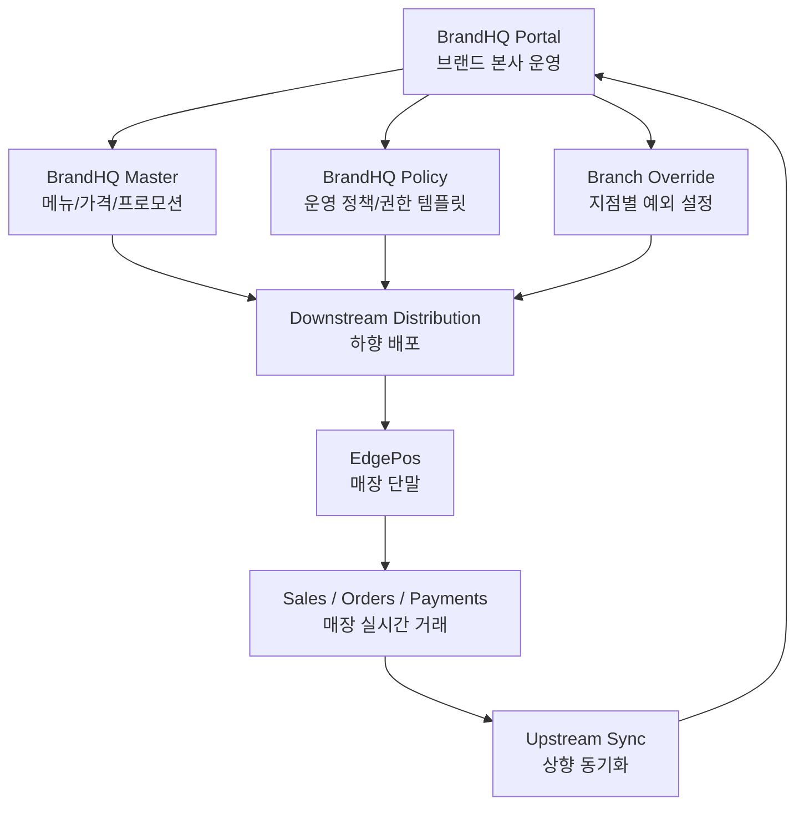

# BrandHQ 브랜드·지점 운영 플랫폼 설계서
# Tài liệu thiết kế nền tảng vận hành BrandHQ · Branch

> 기준 문서:
>
> - `00-Platform-최종-아키텍처-기준서.md` = Platform 전체 스택 기준서
> - `01-SuperAdmin-통합-플랫폼-설계서.md` = 공급사/슈퍼관리자 관점 상위 플랫폼 설계서
> - `02-RegionalDistributor-통합유통-플랫폼-설계서.md` = 대리점/통합유통 설계서
> - `04-Edge-POS-아키텍처-설계서.md` = 매장 단말 Edge POS 설계서
> - `05-Edge-POS-전체-흐름-AZ-가이드.md` = Edge POS 전체 흐름 설명서
> - `06-Edge-POS-P0-P1-설계-보완-체크리스트.md` = Edge POS 보완 체크리스트
>
> Tài liệu căn cứ:
>
> - `00-Platform-최종-아키텍처-기준서.md` = tài liệu chuẩn stack toàn Platform
> - `01-SuperAdmin-통합-플랫폼-설계서.md` = tài liệu platform cấp nhà cung cấp / super admin
> - `02-RegionalDistributor-통합유통-플랫폼-설계서.md` = tài liệu phân phối tích hợp / đại lý
> - `04-Edge-POS-아키텍처-설계서.md` = tài liệu Edge POS tại cửa hàng
> - `05-Edge-POS-전체-흐름-AZ-가이드.md` = tài liệu giải thích toàn bộ luồng Edge POS
> - `06-Edge-POS-P0-P1-설계-보완-체크리스트.md` = checklist bổ sung Edge POS

> 이 문서는 **브랜드 본사 운영 조직**이 여러 지점을 통합 관리하기 위한 설계 기준서다.
> 브랜드가 대리점(RegionalDistributor) 체계 아래에서 운영되는 경우, 이 문서는 그 상위 채널 경계까지 함께 고려한다.
> 공급사 전체 통제 영역은 `01`, 매장 단말 내부 구조는 `03`에서 다룬다.
>
> Tài liệu này là chuẩn thiết kế cho **bộ phận vận hành của thương hiệu/HQ** để quản lý nhiều chi nhánh.
> Trong trường hợp thương hiệu vận hành dưới mô hình đại lý (RegionalDistributor), tài liệu này cũng xét đến ranh giới kênh ở tầng trên đó.
> Phần kiểm soát toàn hệ thống của nhà cung cấp nằm ở `01`, còn cấu trúc bên trong EdgePos nằm ở `03`.

### 1.2 실행/성능/유지보수 원칙

#### 한국어

- 서버 상태는 `Apollo Client`가 담당한다.
- `Redux Toolkit`은 화면 상태, 폼, 필터, wizard 같은 UI 상태에만 한정한다.
- `Redis`와 `DataLoader`는 포털이 직접 쓰지 않는다.
  - Redis는 `SuperAdmin/CentralApi`와 worker가 책임진다.
  - DataLoader는 Apollo Server resolver의 서버 측 책임이다.
- 대량 목록은 pagination, lazy loading, fragment 분리로 처리한다.
- `SharedContracts`를 DTO/enum/event의 단일 원본으로 사용한다.
- `SharedAssets/i18n/locales`를 번역 원본으로 사용한다.
- 유지보수 원칙:
  - master data / price policy / promotion / branch override / operator template 도메인별로 feature를 분리한다.
  - 화면별 서버 상태를 Redux에 중복 저장하지 않는다.
  - query/mutation/component를 동일 domain scope 안에 co-locate한다.
  - BrandHQ는 정책 원본이므로 optimistic update는 안전한 범위에서만 적용한다.

#### Tiếng Việt

- Trạng thái server do `Apollo Client` phụ trách.
- `Redux Toolkit` chỉ dùng cho trạng thái UI như màn hình, form, filter, wizard.
- Portal không dùng trực tiếp `Redis` và `DataLoader`.
  - Redis do `SuperAdmin/CentralApi` và worker phụ trách.
  - DataLoader là trách nhiệm phía server của Apollo Server resolver.
- Danh sách lớn phải xử lý bằng pagination, lazy loading và tách fragment.
- Dùng `SharedContracts` làm nguồn gốc duy nhất cho DTO/enum/event.
- Dùng `SharedAssets/i18n/locales` làm nguồn dịch.
- Nguyên tắc maintainability:
  - Tách feature theo domain master data / price policy / promotion / branch override / operator template.
  - Không lưu trùng server state vào Redux.
  - Co-locate query/mutation/component trong cùng domain scope.
  - BrandHQ là nguồn chính sách nên optimistic update chỉ dùng trong phạm vi an toàn.

---

## 1. 목표
## 1. Mục tiêu

### 한국어

BrandHQ 플랫폼의 목적은 아래 4가지다.

1. 하나의 브랜드가 여러 지점을 공통 정책으로 운영한다.
2. 메뉴, 가격, 프로모션, 직원 권한을 중앙에서 관리한다.
3. 지점별 override를 허용하되 브랜드 표준을 깨지 않도록 통제한다.
4. Edge POS로 내려갈 정책과 카탈로그의 배포 기준이 된다.

### Tiếng Việt

Mục tiêu của BrandHQ platform gồm 4 điểm sau.

1. Cho phép một thương hiệu vận hành nhiều chi nhánh bằng chính sách chung.
2. Quản lý tập trung menu, giá, khuyến mãi và quyền nhân sự.
3. Cho phép override theo chi nhánh nhưng vẫn giữ được chuẩn của thương hiệu.
4. Trở thành nguồn phân phối chính sách và catalog đi xuống Edge POS.

### 1.1 확정 스펙 / Đặc tả cố định

| 구성 | 확정 SPEC | 계약 / 저장소 | 비고 |
|---|---|---|---|
| `BrandHQPortal` | `Next.js(TypeScript) + App Router + Apollo Client` | GraphQL-first | 브랜드 본사 운영 포털 |
| 중앙 연결 | `SuperAdmin/CentralApi` | GraphQL API | 메뉴/가격/프로모션/지점/리포트 |
| UI 상태 | `Redux Toolkit` 필요 시 사용 | - | 화면 상태, 폼, 필터 |
| 다국어 / i18n | `SharedAssets/i18n/locales` + `i18next` | build-time copy | `BrandHQPortal` UI 문자열/메시지의 공통 원본 |
| 직접 DB 접근 | 없음 | - | 모든 영속 데이터는 중앙 API 경유 |
| 하향 배포 대상 | `BrandPosApp` / `EdgePos` | Catalog/Policy | 정책/메뉴/가격 배포 |
| 현장 설정 적용 | `BrandPosApp` Setup/Maintenance mode | Local SQLite | 주변기기, 로컬 설정, 커미셔닝 |

---

## 2. 한눈에 보는 책임
## 2. Trách nhiệm trong một sơ đồ



### 한국어

핵심은 단순하다.

- BrandHQ는 `정책과 마스터의 원본`
- Edge POS는 `실시간 거래의 원본`

### Tiếng Việt

Điểm cốt lõi rất đơn giản.

- BrandHQ là `nguồn gốc của policy và master`
- Edge POS là `nguồn gốc của giao dịch thời gian thực`

---

## 3. 관리 계층 모델
## 3. Mô hình phân cấp quản trị

### 한국어

BrandHQ가 직접 관리하는 기본 계층은 아래와 같다.

- `BrandHQ`
- `Branch`
- `EdgePos`
- `OperatorTemplate`
- `Catalog`
- `Policy`

원칙:

- 브랜드 본사는 최상위 관리 단위다.
- 지점은 독립 운영 단위다.
- EdgePos는 배포 대상 단위다.
- 운영자 실명/출근 데이터와 권한 템플릿은 분리할 수 있어야 한다.

### Tiếng Việt

Các lớp cơ bản mà BrandHQ quản lý trực tiếp gồm.

- `BrandHQ`
- `Branch`
- `EdgePos`
- `OperatorTemplate`
- `Catalog`
- `Policy`

Nguyên tắc.

- BrandHQ là đơn vị quản trị cao nhất.
- Branch là đơn vị vận hành độc lập.
- EdgePos là đơn vị đích để phân phối.
- Dữ liệu nhân sự thực tế và template quyền phải có thể tách rời.

### 3.1 RegionalDistributor boundary
### 3.1 대리점 경계

#### 한국어

`RegionalDistributor`는 BrandHQ보다 상위에 있는 채널/대리점 계층이다.

- 지역/국가 단위 독점 유통권 관리
- 브랜드 온보딩 및 계약 보조
- 로컬 배포/지원 조율
- 브랜드 운영 데이터 자체를 소유하지 않음

#### Tiếng Việt

`RegionalDistributor` là tầng kênh/đại lý nằm trên BrandHQ.

- Quản lý quyền phân phối độc quyền theo khu vực/quốc gia
- Hỗ trợ onboarding và hợp đồng cho thương hiệu
- Điều phối rollout/hỗ trợ tại địa phương
- Không sở hữu trực tiếp dữ liệu vận hành của thương hiệu

---

## 4. 데이터 소유권
## 4. Quyền sở hữu dữ liệu

### 4.1 BrandHQ 원본
### 4.1 Nguồn gốc cấp BrandHQ

#### 한국어

아래 데이터는 BrandHQ이 원본이다.

- 메뉴 마스터
- 가격 정책
- 프로모션 정책
- 세금/서비스 운영 정책
- 브랜드 공지
- 직원 역할 템플릿

#### Tiếng Việt

Các dữ liệu sau có nguồn gốc chính tại BrandHQ.

- Menu master
- Chính sách giá
- Chính sách khuyến mãi
- Chính sách vận hành thuế/phí dịch vụ
- Thông báo toàn thương hiệu
- Template vai trò nhân sự

### 4.2 Branch Override
### 4.2 Override theo chi nhánh

#### 한국어

아래는 지점 단위 override를 허용한다.

- 지점별 판매 여부
- 지점별 가격 예외
- 지점별 프로모션 적용 여부
- 프린터/주방 라우팅
- 영업 시간/휴무

#### Tiếng Việt

Các mục sau được phép override theo chi nhánh.

- Bật/tắt bán theo chi nhánh
- Ngoại lệ giá theo chi nhánh
- Bật/tắt áp dụng khuyến mãi theo chi nhánh
- Routing printer/bếp
- Giờ mở cửa và ngày nghỉ

### 4.3 Edge POS 경계
### 4.3 Ranh giới với Edge POS

#### 한국어

BrandHQ은 아래 데이터를 직접 원본으로 가지지 않는다.

- 진행 중 주문 상태
- 결제 진행 상태
- 테이블 점유 상태
- 장치 연결 상태

이 데이터는 항상 Edge POS와 Edge Local DB가 원본이다.

#### Tiếng Việt

BrandHQ không sở hữu trực tiếp các dữ liệu sau.

- Trạng thái order đang diễn ra
- Trạng thái xử lý thanh toán
- Trạng thái chiếm dụng bàn
- Trạng thái kết nối thiết bị

Dữ liệu này luôn có nguồn gốc chính ở Edge POS và Edge Local DB.

---

## 5. 설정 상속 모델
## 5. Mô hình kế thừa cấu hình

### 한국어

BrandHQ은 아래 우선순위로 설정을 평가한다.

1. `Global Default`
2. `BrandHQ Default`
3. `Branch Override`
4. `EdgePos Override`

규칙:

- override는 최소화한다.
- 어떤 값이 어느 계층에서 왔는지 추적 가능해야 한다.
- 배포 시 `PolicyVersion`, `CatalogVersion`을 함께 관리한다.

### Tiếng Việt

BrandHQ đánh giá cấu hình theo thứ tự ưu tiên sau.

1. `Global Default`
2. `BrandHQ Default`
3. `Branch Override`
4. `EdgePos Override`

Quy tắc.

- Giảm override đến mức tối thiểu.
- Phải truy vết được một giá trị đến từ tầng nào.
- Khi phân phối phải quản lý cùng lúc `PolicyVersion` và `CatalogVersion`.

---

## 6. 배포와 동기화
## 6. Phân phối và đồng bộ

### 한국어

BrandHQ 관점에서는 두 흐름이 중요하다.

- `Downstream Distribution`
  - 메뉴/가격/정책을 지점과 단말로 배포
- `Upstream Sync Consumption`
  - 매장에서 올라온 매출/상태/오류를 수신하여 운영 화면에 반영

중요 원칙:

- 배포는 정책 중심
- 상향 동기화는 운영 가시성 중심
- 실시간 거래 성공 여부는 중앙 API 성공이 아니라 로컬 commit 기준

### Tiếng Việt

Ở góc nhìn BrandHQ, có hai luồng quan trọng.

- `Downstream Distribution`
  - Phân phối menu/giá/chính sách xuống chi nhánh và EdgePos
- `Upstream Sync Consumption`
  - Nhận doanh thu/trạng thái/lỗi từ cửa hàng để phản ánh lên màn hình vận hành

Nguyên tắc quan trọng.

- Phân phối lấy policy làm trung tâm
- Đồng bộ hướng lên lấy khả năng quan sát vận hành làm trung tâm
- Thành công của giao dịch realtime không dựa vào API trung tâm mà dựa vào local commit

---

## 7. 권한 모델
## 7. Mô hình phân quyền

### 한국어

BrandHQ 영역의 최소 역할은 아래와 같다.

- `BrandHQAdmin`
- `BranchManager`
- `Auditor`
- `SupportViewer`

원칙:

- 브랜드 데이터는 브랜드 경계 안에서만 조회한다.
- 공급사 전역 권한은 `01 SuperAdmin` 문서에서 관리한다.
- 민감한 조회는 감사 로그를 남긴다.

### Tiếng Việt

Các vai trò tối thiểu của khu vực BrandHQ gồm.

- `BrandHQAdmin`
- `BranchManager`
- `Auditor`
- `SupportViewer`

Nguyên tắc.

- Dữ liệu của brand chỉ được xem trong phạm vi brand đó.
- Quyền toàn cục của nhà cung cấp được quản lý tại tài liệu `01 SuperAdmin`.
- Các thao tác xem dữ liệu nhạy cảm phải để lại audit log.

---

## 8. 권장 프로젝트 구조
## 8. Cấu trúc dự án được khuyến nghị

```text
Platform/
├── BrandHQPortal/        # 브랜드 본사 운영 웹
├── SuperAdmin/
│   ├── Portal/           # 공급사 운영 웹
│   ├── CentralApi/       # 중앙 계약/API
│   └── SyncWorkers/      # 배포/동기화 워커
├── BrandPosApp/          # 매장 Edge POS + Setup/Maintenance mode
├── SharedKernel/         # 공용 C++ 모듈
├── SharedContracts/      # 공통 계약
└── SharedAssets/         # 공통 자산
```

### 한국어

BrandHQPortal은 중앙 정책과 지점 운영의 접점이다.  
로컬 장치 등록, 커미셔닝, 유지보수 설정은 BrandPosApp의 Setup/Maintenance mode에서 처리한다.
실제 배포, 인증, 동기화는 `SuperAdmin/CentralApi`와 `SuperAdmin/SyncWorkers`와 함께 움직인다.

### Tiếng Việt

BrandHQPortal là điểm giao nhau giữa policy trung tâm và vận hành chi nhánh.  
Đăng ký thiết bị local, commissioning và cấu hình bảo trì được xử lý trong Setup/Maintenance mode của BrandPosApp.
Việc phân phối, xác thực và đồng bộ thực tế phải đi cùng `SuperAdmin/CentralApi` và `SuperAdmin/SyncWorkers`.

---

## 9. 대표 시나리오
## 9. Kịch bản tiêu biểu

### 한국어

1. 본사가 신메뉴를 등록한다.
2. 브랜드 가격 정책을 갱신한다.
3. 특정 지점에만 예외 가격을 준다.
4. `CatalogVersion`, `PolicyVersion`을 생성한다.
5. 배포 대상 지점/단말로 하향 배포한다.
6. 각 Edge POS가 버전을 수신하고 적용 결과를 상향 보고한다.

### Tiếng Việt

1. HQ đăng ký menu mới.
2. Cập nhật chính sách giá của brand.
3. Chỉ định giá ngoại lệ cho một chi nhánh cụ thể.
4. Phát sinh `CatalogVersion`, `PolicyVersion`.
5. Phân phối xuống các chi nhánh/EdgePos đích.
6. Mỗi Edge POS nhận version và báo cáo kết quả áp dụng theo hướng lên.

---

## 10. 문서 관계
## 10. Quan hệ giữa các tài liệu

### 한국어

- `01` 문서: 공급사/슈퍼관리자 관점 플랫폼
- `02` 문서: 브랜드 본사/지점 운영 관점 플랫폼
- `03` 문서: 매장 단말 Edge POS 내부 아키텍처
- `04` 문서: Edge POS 실제 동작 흐름

### Tiếng Việt

- Tài liệu `01`: platform ở góc nhìn nhà cung cấp / super admin
- Tài liệu `02`: platform ở góc nhìn vận hành brand/branch
- Tài liệu `03`: kiến trúc bên trong EdgePos tại cửa hàng
- Tài liệu `04`: luồng vận hành thực tế của Edge POS

---

## 11. 최종 원칙
## 11. Nguyên tắc cuối cùng

### 한국어

1. BrandHQ는 정책과 마스터를 관리하고, 실시간 거래 원본은 가지지 않는다.
2. 지점 override는 허용하되 버전과 출처를 추적 가능해야 한다.
3. 중앙 정책 배포와 매장 거래 동기화를 혼동하지 않는다.
4. 브랜드 운영 권한과 공급사 운영 권한을 분리한다.

### Tiếng Việt

1. BrandHQ quản lý policy và master, nhưng không sở hữu giao dịch realtime.
2. Override theo chi nhánh được phép nhưng phải truy vết được version và nguồn gốc.
3. Không trộn lẫn việc phân phối policy trung tâm với đồng bộ giao dịch từ cửa hàng.
4. Phải tách quyền vận hành của brand khỏi quyền vận hành của nhà cung cấp.
