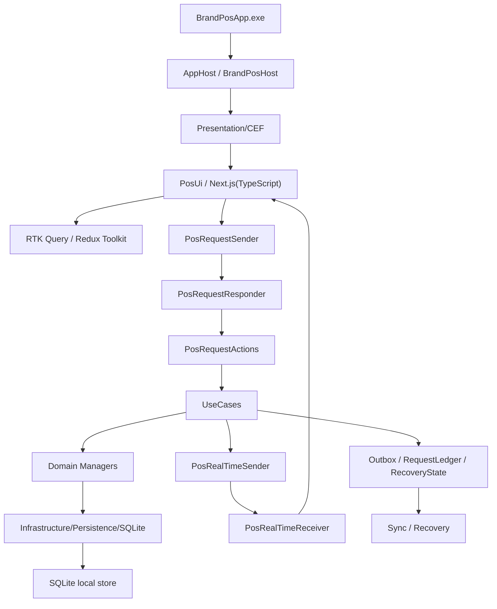
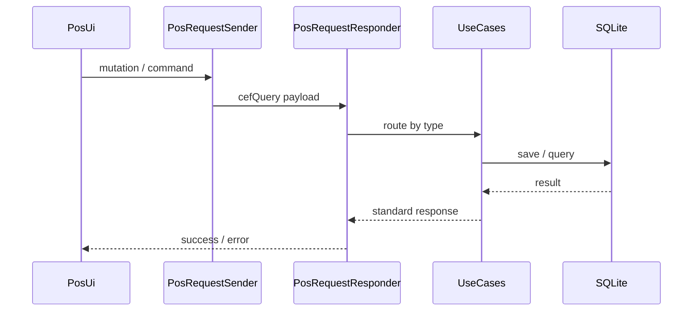

# Edge POS 전체 흐름 A-Z 가이드
# Hướng dẫn A-Z luồng Edge POS

> 기준 문서 / Tài liệu căn cứ: `04-Edge-POS-아키텍처-설계서.md`
>
> 이 문서는 실제 코드 완성도를 평가하는 문서가 아니라, **최종 설계 기준으로 Edge POS가 어떻게 동작해야 하는지**를 A부터 Z까지 순서대로 설명한다.

---

## 1. 이 문서의 목적 / Mục đích

### 한국어

이 문서는 다음을 설명한다.

- POS가 어디서 시작하는가
- C++ / CEF / Next.js(TypeScript) / RTK Query가 어떻게 연결되는가
- 화면에서 입력한 작업이 어떤 계층을 지나 SQLite까지 가는가
- 저장 후 화면은 어떻게 갱신되는가
- 오프라인, 동기화, 복구, 설정 모드는 어떻게 동작하는가
- 각 파일이 어느 지점에서 책임을 가지는가

### Tiếng Việt

Tài liệu này giải thích:

- POS bắt đầu từ đâu
- C++ / CEF / Next.js(TypeScript) / RTK Query kết nối với nhau thế nào
- Một thao tác trên màn hình đi qua tầng nào để tới SQLite
- Sau khi lưu thì UI được cập nhật ra sao
- Offline, sync, recovery và setup mode hoạt động như thế nào
- Mỗi file chịu trách nhiệm ở điểm nào

---

## 2. 한 장 요약 / Tóm tắt một trang

| 관점 | 한국어 | Tiếng Việt |
|---|---|---|
| 실행 형태 | `BrandPosApp.exe`가 실행되는 네이티브 POS 프로그램 | Chương trình POS native chạy bằng `BrandPosApp.exe` |
| UI | `CEF` 안에서 `Next.js(TypeScript)`가 동작 | `Next.js(TypeScript)` chạy bên trong `CEF` |
| 상태 관리 | 서버 상태는 `RTK Query`, 로컬 UI 상태는 `Redux Toolkit slice` | Server state dùng `RTK Query`, local UI state dùng `Redux Toolkit slice` |
| 요청 진입점 | UI 요청은 `PosRequestSender` 하나로 들어간다 | Request từ UI đi vào qua một cửa duy nhất là `PosRequestSender` |
| 업무 처리 | `UseCases`가 트랜잭션과 순서를 조정한다 | `UseCases` điều phối transaction và thứ tự xử lý |
| 도메인 규칙 | `Domain/*Manager`가 업무 규칙을 가진다 | `Domain/*Manager` giữ quy tắc nghiệp vụ |
| 저장 | 최종 저장소는 `SQLite`다 | Lưu trữ cuối cùng là `SQLite` |
| 실시간 갱신 | C++는 `PosRealTimeSender`로 UI를 다시 깨운다 | C++ phát realtime qua `PosRealTimeSender` để đánh thức UI |
| 복구 | 복구는 UI cache가 아니라 local store 기준이다 | Phục hồi dựa trên local store chứ không dựa trên UI cache |

---

## 3. 전체 흐름 / Luồng tổng thể

### 한국어

이 다이어그램을 한 줄로 요약하면 다음과 같다.

`exe 시작 → CEF 로드 → Next.js UI 표시 → RTK Query로 화면 준비 → 요청 전달 → UseCase → Domain → SQLite 저장 → 실시간 이벤트 → 화면 갱신`

### Tiếng Việt

Tóm gọn sơ đồ trên thành một câu:

`Khởi động exe → load CEF → hiển thị Next.js UI → chuẩn bị màn hình bằng RTK Query → gửi request → UseCase → Domain → lưu SQLite → realtime event → cập nhật UI`

---

## 4. 시작점 A: 실행은 어디서 시작하는가 / Điểm A: bắt đầu từ đâu

### 한국어

시작점은 `BrandPosApp/AppHost/BrandPosHost/BrandPosApp.cpp`다.

실행 순서는 아래와 같다.

1. `BrandPosApp.cpp`
   - 프로세스 시작
   - native host 진입
2. `CefBootstrap.cpp`
   - CEF 초기화
   - 캐시/세션/서브프로세스 설정
3. **SQLite 무결성 검사**
   - `PRAGMA integrity_check;` 실행
   - 오염(corruption) 감지 시 복구 모드 진입 또는 사용자 알림
   - 정상 확인 후에만 다음 단계로 진행
4. `CefAppHandler.cpp`
   - CEF 앱 핸들러 등록
5. `CefSchemeHandler.cpp`
   - `app://pos/`를 정적 UI 파일에 매핑
5. `CefBrowserDlg.cpp`
   - 메인 브라우저 생성
6. `BrowserRecoveryManager.cpp`
   - 브라우저 생명주기와 crash 회복 감시

### Tiếng Việt

Điểm bắt đầu là `BrandPosApp/AppHost/BrandPosHost/BrandPosApp.cpp`.

Thứ tự chạy:

1. `BrandPosApp.cpp`
   - khởi động process
   - vào native host
2. `CefBootstrap.cpp`
   - khởi tạo CEF
   - cấu hình cache/session/subprocess
3. **Kiểm tra tính toàn vẹn SQLite**
   - Chạy `PRAGMA integrity_check;`
   - Nếu phát hiện hỏng (corruption): vào chế độ phục hồi hoặc thông báo người dùng
   - Chỉ tiếp tục bước tiếp theo sau khi xác nhận bình thường
4. `CefAppHandler.cpp`
   - đăng ký handler của CEF
5. `CefSchemeHandler.cpp`
   - ánh xạ `app://pos/` sang file UI tĩnh
5. `CefBrowserDlg.cpp`
   - tạo browser chính
6. `BrowserRecoveryManager.cpp`
   - giám sát vòng đời browser và recovery khi crash

---

## 5. 시작점 B: PosUi는 어떻게 뜨는가 / Điểm B: PosUi được tải như thế nào

### 한국어

CEF는 일반 웹사이트를 여는 것이 아니라 `PosUi`의 정적 빌드 결과를 읽는다.

- `PosUi/src/app/layout.tsx`
  - 공통 layout
- `PosUi/src/app/page.tsx`
  - 루트 진입
- `PosUi/src/app/pos/table/page.tsx`
  - 테이블 화면
- `PosUi/src/app/pos/order/page.tsx`
  - 주문 화면
- `PosUi/src/app/pos/payment/page.tsx`
  - 결제 화면
- `PosUi/src/app/Setup/page.tsx`
  - Setup mode
- `PosUi/src/app/Maintenance/page.tsx`
  - Maintenance mode

### Tiếng Việt

CEF không mở một website bình thường mà đọc output build tĩnh của `PosUi`.

- `PosUi/src/app/layout.tsx`
  - layout chung
- `PosUi/src/app/page.tsx`
  - entry root
- `PosUi/src/app/pos/table/page.tsx`
  - màn hình bàn
- `PosUi/src/app/pos/order/page.tsx`
  - màn hình order
- `PosUi/src/app/pos/payment/page.tsx`
  - màn hình thanh toán
- `PosUi/src/app/Setup/page.tsx`
  - Setup mode
- `PosUi/src/app/Maintenance/page.tsx`
  - Maintenance mode

---

## 6. 시작점 C: 화면 초기화 / Điểm C: khởi tạo màn hình

### 한국어

화면이 켜질 때 우선 `RTK Query`가 초기 데이터를 읽는다.

- 테이블 목록
- 현재 선택된 테이블
- 주문 목록
- 결제 대기 상태
- 시스템 설정
- 장치 연결 상태

화면의 역할은 데이터를 직접 만들지 않고, **이미 있는 상태를 읽어 렌더링하는 것**이다.

### Tiếng Việt

Khi màn hình mở lên, `RTK Query` đọc dữ liệu ban đầu trước.

- danh sách bàn
- bàn đang chọn
- danh sách order
- trạng thái chờ thanh toán
- cấu hình hệ thống
- trạng thái kết nối thiết bị

Nhiệm vụ của màn hình không phải tự tạo dữ liệu mà là **đọc trạng thái có sẵn để render**.

---

## 7. 요청 흐름 D: UI에서 C++로 / Luồng D: từ UI sang C++

### 한국어

사용자가 버튼을 누르면 `screen → RTK Query mutation 또는 bridge command → PosRequestSender` 순서로 흐른다.

핵심 파일은 아래다.

- `PosUi/src/bridge/PosRequestSender.ts`
- `PosUi/src/bridge/adapters/cefTransport.ts`
- `Presentation/CEF/InternalBridge/PosRequestResponder.cpp`
- `Presentation/CEF/InternalBridge/PosRequestActions/*`

이 계층의 책임은 다음과 같다.

- 표준 메시지 프레임 생성
- idempotency key 부여
- 파라미터 검증
- 도메인별 라우팅
- 실패 시 표준 error 응답 반환

### Tiếng Việt

Khi người dùng bấm nút, luồng đi theo thứ tự `screen → RTK Query mutation hoặc bridge command → PosRequestSender`.

Các file chính:

- `PosUi/src/bridge/PosRequestSender.ts`
- `PosUi/src/bridge/adapters/cefTransport.ts`
- `Presentation/CEF/InternalBridge/PosRequestResponder.cpp`
- `Presentation/CEF/InternalBridge/PosRequestActions/*`

Trách nhiệm của tầng này:

- tạo message frame chuẩn
- gắn idempotency key
- kiểm tra tham số
- routing theo domain
- trả lỗi chuẩn khi thất bại

---

## 8. 시작점 E: 데이터는 어디로 저장되는가 / Luồng E: dữ liệu được lưu ở đâu

### 한국어

Edge POS의 최종 저장소는 `SQLite`다.

저장 순서는 다음과 같다.

1. `UseCases`가 작업을 시작한다.
2. `Domain`이 업무 규칙을 검증한다.
3. `Infrastructure/Persistence/SQLite/Tables/*Crud.cpp`가 저장 SQL을 실행한다.
4. `RequestLedger`가 중복 방지를 기록한다.
5. `Outbox`가 중앙 동기화 대기 항목을 쌓는다.
6. 저장 성공이 되면 커밋을 완료한다.

### Tiếng Việt

Kho lưu trữ cuối cùng của Edge POS là `SQLite`.

Thứ tự lưu:

1. `UseCases` bắt đầu công việc
2. `Domain` kiểm tra quy tắc nghiệp vụ
3. `Infrastructure/Persistence/SQLite/Tables/*Crud.cpp` thực thi SQL lưu
4. `RequestLedger` ghi chống trùng lặp
5. `Outbox` tạo hàng đợi sync lên trung tâm
6. Thành công thì commit hoàn tất

---

## 9. 시작점 F: 저장 후 화면은 어떻게 바뀌는가 / Luồng F: sau khi lưu UI đổi như thế nào

### 한국어

저장 후 화면 갱신은 **두 가지 경로**가 있고, **중복되지 않아야** 한다.

#### 경로 1: 내가 보낸 mutation의 결과 (즉시, 동기적)

- mutation 성공 시 `onQueryStarted` + `updateQueryData`로 RTK Query 캐시를 **직접 패치**한다.
- `invalidatesTags`를 사용하지 않는다 (refetch 없이 캐시만 갱신).
- 예: `TABLE:SELECT` 성공 → 해당 테이블의 `status`를 `'OCCUPIED'`로 직접 변경.

#### 경로 2: 외부 변경의 실시간 이벤트 (비동기, C++ push)

- C++가 `PosRealTimeSender`로 `CustomEvent('POS_NATIVE_EVENT')` 발송.
- `PosRealTimeReceiver`가 수신하되, **자기가 보낸 요청의 응답 이벤트는 무시**한다.
  - `isPendingRequest(detail.requestId)`로 확인.
  - 내 요청의 결과 → 이미 경로 1에서 처리됨 → skip.
  - 다른 POS/배달앱 등 외부 변경 → `invalidateTags`로 해당 범위만 refetch.

#### 태그 세분화 규칙

- `['Table']` 같은 도메인 전체 태그로 전체 목록을 통째로 재조회하지 않는다.
- 태그는 `'TableList'`, `{ type: 'Table', id: 3 }`, `{ type: 'Floor', id: 1 }` 등으로 세분화한다.
- 이벤트 payload에 `tableId`, `floorId` 등 대상 식별자가 포함되어야 한다.

#### 핵심 원칙

- **같은 변경에 대해 2번 refetch하지 않는다.**
- **부분 변경에 전체 재조회하지 않는다.**
- **상태 변경 mutation에는 반드시 `idempotencyKey`를 부여한다.**

### Tiếng Việt

Sau khi lưu, có **hai đường** cập nhật UI và **không được trùng lặp**.

#### Đường 1: Kết quả mutation mà mình gửi (tức thời, đồng bộ)

- Khi mutation thành công, dùng `onQueryStarted` + `updateQueryData` để **patch trực tiếp** cache RTK Query.
- Không dùng `invalidatesTags` (chỉ cập nhật cache, không refetch).
- Ví dụ: `TABLE:SELECT` thành công → đổi `status` của bàn đó thành `'OCCUPIED'` trực tiếp.

#### Đường 2: Event realtime từ thay đổi bên ngoài (bất đồng bộ, C++ push)

- C++ gửi `CustomEvent('POS_NATIVE_EVENT')` qua `PosRealTimeSender`.
- `PosRealTimeReceiver` nhận nhưng **bỏ qua event từ request mà mình đã gửi**.
  - Kiểm tra bằng `isPendingRequest(detail.requestId)`.
  - Kết quả request của mình → đã xử lý ở đường 1 → skip.
  - Thay đổi từ POS khác/app giao hàng → `invalidateTags` chỉ phạm vi liên quan.

#### Quy tắc phân chia tag

- Không dùng tag domain toàn bộ như `['Table']` để reload toàn bộ danh sách.
- Chia nhỏ tag: `'TableList'`, `{ type: 'Table', id: 3 }`, `{ type: 'Floor', id: 1 }`.
- Payload event phải bao gồm identifier như `tableId`, `floorId`.

#### Nguyên tắc cốt lõi

- **Không refetch 2 lần cho cùng một thay đổi.**
- **Không reload toàn bộ cho thay đổi một phần.**
- **Mutation thay đổi trạng thái phải có `idempotencyKey`.**

---

## 10. 시작점 G: 대표 업무 흐름 / Luồng G: các nghiệp vụ tiêu biểu

### 10.1 테이블 선택 / Chọn bàn

1. UI가 테이블 선택 버튼을 누른다.
2. `PosRequestSender`가 선택 요청을 전송한다.
3. `UseCases/Table/SelectTableUseCase`가 요청을 받는다.
4. `Domain/Table/TableManager`가 점유 규칙을 검사한다.
5. `SQLite`가 테이블 상태를 저장한다.
6. `PosRealTimeSender`가 다른 화면에 갱신을 알린다.

### 10.2 주문 생성 / Tạo order

1. 주문 화면에서 상품과 수량을 선택한다.
2. `Order` 요청이 `PosRequestSender`로 들어간다.
3. `UseCases/Order`가 주문 생성 트랜잭션을 시작한다.
4. `Domain/Order`가 메뉴/수량/할인/옵션 규칙을 검사한다.
5. `OrderSlip`과 `OrderItem`이 local `SQLite`에 저장된다.
6. 화면과 주방/연동 대상이 실시간으로 갱신된다.

### 10.3 결제 처리 / Xử lý thanh toán

1. 결제 버튼을 누른다.
2. `UseCases/Payment`가 결제 모드를 선택한다.
3. 현금이면 local 저장 후 완료된다.
4. 카드/외부 승인형 결제면 장치/외부 연동을 거친다.
5. 성공 결과가 `SellSlip`, `SellDetail`, `UserPayment`, `WaitPayment` 등으로 정리된다.
6. `Outbox`에 중앙 동기화 이벤트가 적재된다.

### Tiếng Việt

1. Chọn bàn.
2. Request đi qua `PosRequestSender`.
3. `UseCases/Table/SelectTableUseCase` nhận request.
4. `Domain/Table/TableManager` kiểm tra quy tắc chiếm bàn.
5. `SQLite` lưu trạng thái bàn.
6. `PosRealTimeSender` báo cập nhật cho các màn hình khác.

1. Chọn sản phẩm và số lượng trên màn hình order.
2. Request order đi vào `PosRequestSender`.
3. `UseCases/Order` bắt đầu transaction tạo order.
4. `Domain/Order` kiểm tra quy tắc menu/số lượng/giảm giá/options.
5. `OrderSlip` và `OrderItem` được lưu vào `SQLite` local.
6. Màn hình và các đối tượng liên quan được cập nhật realtime.

1. Bấm thanh toán.
2. `UseCases/Payment` chọn chế độ thanh toán.
3. Nếu tiền mặt thì lưu local và hoàn tất.
4. Nếu thanh toán thẻ/approval ngoài thì đi qua thiết bị hoặc tích hợp ngoài.
5. Kết quả thành công được chuẩn hóa thành `SellSlip`, `SellDetail`, `UserPayment`, `WaitPayment`.
6. Event đồng bộ trung tâm được đưa vào `Outbox`.

---

## 11. 시작점 H: Setup / Maintenance 모드 / Luồng H: Setup / Maintenance mode

### 한국어

`BrandPosApp` 내부의 Setup/Maintenance 모드는 운영 POS와 같은 엔진을 쓰지만 목적이 다르다.

- Setup
  - 최초 설치
  - 네트워크/장치 설정
  - 브랜치/터미널 바인딩
  - 초기 데이터 저장
- Maintenance
  - 장치 점검
  - 설정 재적용
  - 로컬 상태 복구
  - 운영 문제 진단

Setup/Maintenance는 별도 제품이 아니라 **같은 executable의 다른 mode**다.

### Tiếng Việt

Setup/Maintenance mode trong `BrandPosApp` dùng cùng engine với POS vận hành nhưng mục đích khác nhau.

- Setup
  - cài đặt ban đầu
  - cấu hình mạng/thiết bị
  - gán branch/terminal
  - lưu dữ liệu ban đầu
- Maintenance
  - kiểm tra thiết bị
  - áp lại cấu hình
  - phục hồi trạng thái local
  - chẩn đoán vấn đề vận hành

Setup/Maintenance không phải sản phẩm riêng mà là **mode khác của cùng một executable**.

---

## 12. 시작점 I: 동기화는 어떻게 일어나는가 / Luồng I: sync diễn ra thế nào

### 한국어

동기화는 즉시 쓰기와 분리된다.

1. local `SQLite`에 먼저 저장한다.
2. `Outbox`에 동기화 작업을 적재한다.
3. `Sync` 계층이 중앙으로 보낸다.
4. 실패하면 **지수 백오프(Exponential Backoff)**로 재시도한다.
   - 1초 → 5초 → 30초 → 5분 → 30분 (최대 간격)
   - 재시도 간격에 ±20% jitter를 추가하여 Thundering Herd 문제를 방지한다.
   - 다수의 POS가 동시에 재시도하여 서버에 과부하를 주는 것을 막는다.
5. 성공하면 Outbox 상태를 `ACKED`로 바꾼다.
6. `RequestLedger`는 같은 요청의 중복 처리를 막는다.

중앙 시스템은 Edge의 데이터 원본이 아니라 **동기화 대상**이다.

### Tiếng Việt

Sync được tách khỏi thao tác ghi tức thời.

1. Lưu trước vào `SQLite` local.
2. Đưa job sync vào `Outbox`.
3. Tầng `Sync` gửi lên trung tâm.
4. Nếu lỗi thì retry bằng **Exponential Backoff (lùi thời gian theo cấp số mũ)**.
   - 1 giây → 5 giây → 30 giây → 5 phút → 30 phút (khoảng cách tối đa)
   - Thêm jitter ±20% vào khoảng cách retry để ngăn vấn đề Thundering Herd.
   - Ngăn tất cả POS retry đồng thời gây quá tải server.
5. Khi thành công, đổi trạng thái Outbox thành `ACKED`.
6. `RequestLedger` ngăn xử lý trùng request.

Hệ thống trung tâm không phải nguồn dữ liệu gốc của Edge mà là **đối tượng sync**.

---

## 13. 시작점 J: 복구는 어떻게 되는가 / Luồng J: phục hồi thế nào

### 한국어

복구는 UI cache를 기준으로 하지 않는다.

- 브라우저 crash 발생
- `BrowserRecoveryManager`가 감지
- CEF browser 재생성
- `RecoveryState`와 local `SQLite`에서 마지막 상태 재구성
- `PosUi` bootstrap 다시 수행

즉, 복구의 기준은 브라우저가 아니라 **local store**다.

### Tiếng Việt

Phục hồi không dựa vào UI cache.

- Browser crash xảy ra
- `BrowserRecoveryManager` phát hiện
- tạo lại CEF browser
- tái dựng trạng thái cuối từ `RecoveryState` và local `SQLite`
- chạy lại bootstrap của `PosUi`

Nói cách khác, tiêu chuẩn phục hồi là **local store**, không phải browser.

---

## 14. 파일 기준 A-Z / A-Z theo file

| 단계 | 파일 |
|---|---|
| 시작 | `BrandPosApp/AppHost/BrandPosHost/BrandPosApp.cpp` |
| CEF 초기화 | `BrandPosApp/AppHost/BrandPosHost/CefBootstrap.cpp` |
| 브라우저 핸들러 | `BrandPosApp/Presentation/CEF/Handlers/CefAppHandler.cpp` |
| 스킴 매핑 | `BrandPosApp/Presentation/CEF/Handlers/CefSchemeHandler.cpp` |
| 메인 브라우저 | `BrandPosApp/Presentation/CEF/Handlers/CefBrowserDlg.cpp` |
| UI 진입 | `BrandPosApp/PosUi/src/app/layout.tsx`, `BrandPosApp/PosUi/src/app/page.tsx` |
| 화면 시작 | `BrandPosApp/PosUi/src/app/pos/*/page.tsx` |
| 상태 관리 | `BrandPosApp/PosUi/src/store/api/*.ts`, `BrandPosApp/PosUi/src/store/slices/*.ts` |
| 요청 송신 | `BrandPosApp/PosUi/src/bridge/PosRequestSender.ts` |
| CEF 전송 | `BrandPosApp/PosUi/src/bridge/adapters/cefTransport.ts` |
| C++ 수신 | `BrandPosApp/Presentation/CEF/InternalBridge/PosRequestResponder.cpp` |
| 라우팅 | `BrandPosApp/Presentation/CEF/InternalBridge/PosRequestActions/*` |
| 유스케이스 | `BrandPosApp/UseCases/*` |
| 도메인 | `BrandPosApp/Domain/*` |
| 저장 | `BrandPosApp/Infrastructure/Persistence/SQLite/Tables/*` |
| 복합 조회 | `BrandPosApp/Infrastructure/Persistence/SQLite/ReadModels/*` |
| 운영 저장 | `BrandPosApp/Infrastructure/Persistence/SQLite/Stores/*` |
| 실시간 송신 | `BrandPosApp/Presentation/CEF/InternalBridge/PosRealTimeSender.cpp` |
| 실시간 수신 | `BrandPosApp/PosUi/src/providers/PosRealTimeReceiver.ts` |
| 동기화 | `BrandPosApp/Infrastructure/Sync/*` |
| 하드웨어 | `BrandPosApp/Infrastructure/Device/*` |

---

## 15. 중앙 플랫폼 연계 상태 / Trạng thái liên kết platform trung tâm

### 한국어

- 현재 A~J 흐름의 성공 기준은 계속 `local SQLite commit + Outbox/Recovery`다.
- `@platform/api-sdk`는 `SharedContracts/ApiSdk`에 초기 패키지로 추가되어 Setup/Maintenance mode와 Portal/Edge 도구가 CentralApi contract를 같은 타입으로 공유할 수 있는 기반이 생겼다.
- `cursor pagination`은 현재 `auditLogConnection`, `syncEventConnection`에 적용됐고, Edge의 local commit 경로는 바꾸지 않는다.
- `APQ`는 CentralApi에 실제 활성화됐으며, Edge의 `cefQuery`/bridge 경로를 바꾸지 않는다.
- persisted query allow-list는 SDK manifest 자동 생성 + CentralApi generated allow-list 강제로 구현됐고, Edge의 `cefQuery`/bridge 경로를 바꾸지 않는다.
- `Prisma multi-file schema`와 `SWC builder`는 중앙 유지보수/빌드 속도 개선으로 실제 전환이 완료됐다.
- 다음 백로그는 Portal의 `@platform/api-sdk` 직접 채택 확대, `Branch / EdgePos / DeployRelease` mutation 보강, production allow-list drift 검증이다.

### Tiếng Việt

- Tiêu chuẩn thành công của luồng A~J vẫn là `local SQLite commit + Outbox/Recovery`.
- `@platform/api-sdk` đã được thêm dưới dạng gói ban đầu tại `SharedContracts/ApiSdk`, tạo nền tảng để Setup/Maintenance mode và Portal/Edge tools dùng cùng contract của CentralApi với cùng type.
- `cursor pagination` hiện đã áp dụng cho `auditLogConnection` và `syncEventConnection`, nhưng không thay đổi đường commit local của Edge.
- `APQ` đã bật ở CentralApi và không thay đổi tuyến `cefQuery`/bridge của Edge.
- persisted query allow-list đã được triển khai bằng cách tự tạo SDK manifest và cưỡng chế generated allow-list ở CentralApi; điều này không thay đổi tuyến `cefQuery`/bridge của Edge.
- `Prisma multi-file schema` và `SWC builder` đã được chuyển đổi ở phía trung tâm để cải thiện maintainability/build speed.
- Backlog tiếp theo là mở rộng việc áp dụng trực tiếp `@platform/api-sdk` trong portal, bổ sung mutation cho `Branch / EdgePos / DeployRelease`, và kiểm tra drift của allow-list ở production.

---

## 16. 최종 요약 / Tóm tắt cuối cùng

### 한국어

이 프로젝트의 Edge POS 흐름은 아래 한 줄로 끝난다.

`BrandPosApp.exe → CEF → Next.js(TypeScript) + RTK Query → PosRequestSender → UseCases → Domain → SQLite → PosRealTimeSender → UI 갱신 → Outbox/Sync/Recovery`

### Tiếng Việt

Luồng Edge POS của dự án này có thể gói trong một dòng:

`BrandPosApp.exe → CEF → Next.js(TypeScript) + RTK Query → PosRequestSender → UseCases → Domain → SQLite → PosRealTimeSender → cập nhật UI → Outbox/Sync/Recovery`
